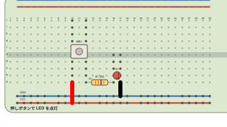

# Breadkit

Breadkit describes breadboard circuits in Ruby, resolves physical hole connections, checks common wiring errors, and draws the result as an SVG or raster image. Ruby 3.3 or newer is required.

| Gem | Command | Purpose |
| --- | --- | --- |
| `breadkit` | `breadkit` | DSL, board and part definitions, connectivity analysis, JSON IR |
| `breadkit-render` | `bkrender` | Standalone SVG, PNG, and JPEG diagrams |
| `breadkit-lint` | `bklint` | Layout, electrical, and declared-intent checks |

`breadkit-render` and `breadkit-lint` install the core as a dependency.

## Quick start

```sh
gem install breadkit-render breadkit-lint
bklint examples/01_led_button.bk.rb
bkrender examples/01_led_button.bk.rb -o /tmp/led.svg --show-nets --legend
```



```ruby
title "Button controlled LED"
board :half
supply :USB, voltage: 5, plus: "B+1", minus: "B-1"
net :VCC, at: "B+1"
net :GND, at: "B-1"

button :SW1, at: "e10"
resistor :R1, "330", pins: %w[a12 a16]
led :D1, color: :red, anode: "b16", cathode: "b17"
wire "a10", "B+", color: :red
wire "a17", "B-", color: :black
```

See [the DSL reference](docs/dsl.md) and the individual package READMEs for command options.

## Safety

DSL files execute as Ruby code. Do not load files from untrusted sources. IR JSON is a data-only input format and is suitable when code execution is not acceptable.

## Development

Run `rbenv exec rake` in each package directory. This runs its static checks and RSpec suite. The renderer uses optional `rsvg-convert`, `ruby-vips`, or ImageMagick backends for PNG and JPEG; SVG output has no rasterizer dependency.

See [CHANGELOG.md](CHANGELOG.md) for the package release notes.
