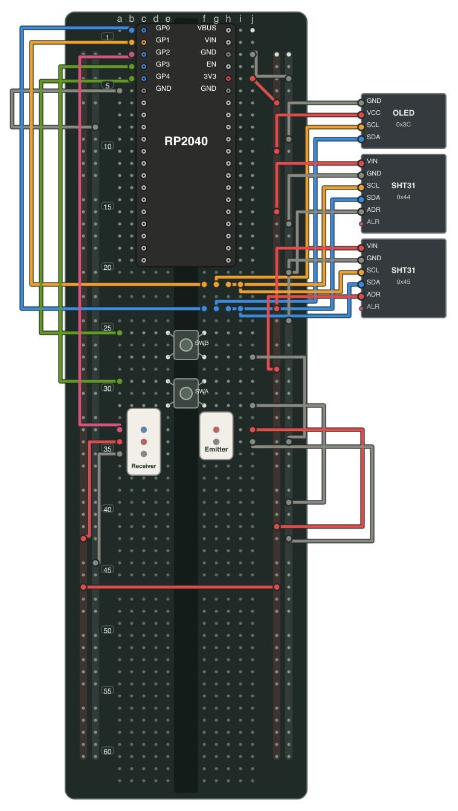

<p align="center">
  
</p>

<h1 align="center">breadkit</h1>

<p align="center">
  <strong>Describe breadboard circuits in Ruby, YAML, or TOML. See how every connection fits together.</strong>
</p>

<p align="center">
  <a href="https://rubygems.org/gems/breadkit"></a>
  <a href="https://github.com/breadkit/breadkit/actions/workflows/ci.yml"></a>
  
  <a href="LICENSE.txt"></a>
</p>

Breadkit resolves board holes, part pins, wires, and switch states into connected
nets. It exports JSON IR for other tools and checks declared connection intent.

<p align="center">
  
</p>

<p align="center">
  <a href="examples/05_sensor_demo.bk.rb">Circuit source</a> ·
  <a href="https://breadkit.github.io/breadkit-render/images/sensor-demo.svg">Explore its layers</a>
</p>

## Quick start

Install with Ruby 3.3 or newer:

```sh
gem install breadkit
```

Save this as `circuit.bk.rb`:

```ruby
title "Button and LED"
board :half

supply :USB, voltage: 5.0, plus: "B+1", minus: "B-1"
net :VCC, at: "B+1"
net :GND, at: "B-1"

button :SW1, at: "e10"
resistor :R1, "330", pins: %w[a12 a16]
led :D1, color: :red, anode: "b16", cathode: "b17"

wire "a10", "B+", color: :red
wire "a17", "B-", color: :black
```

```sh
breadkit nets circuit.bk.rb
breadkit ir circuit.bk.rb > circuit.json
```

This README follows main (0.2.0). If `breadkit --version` shows an older
published release, use the [source checkout](#development) for newer features.
The same circuit is available in [YAML](examples/06_declarative_led.bk.yml) and
[TOML](examples/07_declarative_led.bk.toml).

## Layered module example

The [sensor demo](examples/05_sensor_demo.bk.rb) combines an RP2040 module with
an OLED, two SHT31 sensors, switches, and IR modules. Its `layer:` declarations
group parts and wires in the interactive SVG. These lines are from the full
example:

```ruby
offboard :OLED, :ssd1306_oled, side: :right, at: "a7", address: "0x3C", layer: "2 I2C"
offboard :SHT31A, :sht31, side: :right, at: "a12", address: "0x44", unused: ["ALR"], layer: "2 I2C"
offboard :SHT31B, :sht31, side: :right, at: "a19", address: "0x45", unused: ["ALR"], layer: "2 I2C"

wire "j5", "T+5", color: "#E24B4A", layer: "1 Power"
wire "OLED.SDA", "g24", color: "#378ADD", route: :edge, layer: "2 I2C"
```

Run `bundle exec ruby exe/breadkit nets examples/05_sensor_demo.bk.rb` from a
source checkout to inspect the full circuit. The optional 5 V emitter layer is
an alternative: disconnect its 3.3 V feed before using it.

## Explore

- [User guide](https://breadkit.github.io/breadkit/guide/) and [circuit gallery](https://breadkit.github.io/breadkit/gallery/)
- [DSL reference](https://breadkit.github.io/breadkit/guide/dsl/) and [component catalog](https://breadkit.github.io/breadkit/guide/components/)
- [CLI reference](docs/CLI.md), [YAML/TOML guide](docs/DECLARATIVE.md), and [JSON IR](docs/IR.md)
- [Browser Playground](https://breadkit.github.io/breadkit/playground/) and [editor integration](docs/LSP.md)
- [MCP server](docs/MCP.md), [Rake task](docs/RAKE.md), [jumper kit](docs/JUMPER_KIT.md), and [definition lockfile](docs/LOCK.md)

The companion repositories are [breadkit-render](https://github.com/breadkit/breadkit-render)
for diagrams, [breadkit-lint](https://github.com/breadkit/breadkit-lint)
for circuit checks, [breadkit-rspec](https://github.com/breadkit/breadkit-rspec)
for connection matchers, and [breadkit-parts](https://github.com/breadkit/breadkit-parts)
for model-specific definitions. Each gem is released independently.

Ruby DSL files execute code; load only files you trust. YAML, TOML, and JSON IR
are parsed as data.

## Development

```sh
git clone https://github.com/breadkit/breadkit.git
cd breadkit
bundle install
bundle exec ruby exe/breadkit nets examples/01_led_button.bk.rb
bundle exec rake
```

Clone companion repositories beside this checkout when working on their main
branches. See the [compatibility policy](docs/COMPATIBILITY.md) before changing
a public data format.

## License

[MIT](LICENSE.txt).
