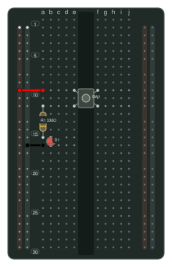

<p align="center">
  
</p>

<h1 align="center">breadkit</h1>

<p align="center">
  <strong>Describe breadboard circuits in Ruby, YAML, or TOML. See how every connection fits together.</strong>
</p>

<p align="center">
  <a href="https://rubygems.org/gems/breadkit"></a>
  <a href="https://github.com/breadkit/breadkit/actions/workflows/ci.yml"></a>
  
  <a href="LICENSE.txt"></a>
</p>

<p align="center">
  <a href="#quick-start">Quick start</a> ·
  <a href="#what-breadkit-provides">Features</a> ·
  <a href="#documentation">Documentation</a> ·
  <a href="#development">Development</a> ·
  <a href="https://breadkit.github.io/breadkit/">Website</a>
</p>

---

Breadkit is the core of a three-gem toolkit for breadboard circuits. It turns a
Ruby description of boards, components, and wires into resolved connections and
JSON IR. [breadkit-render](https://github.com/breadkit/breadkit-render) draws the
circuit; [breadkit-lint](https://github.com/breadkit/breadkit-lint) checks it.

<p align="center">
  
</p>

<p align="center"><sub>A circuit described with Breadkit and drawn with breadkit-render.</sub></p>

## Quick start

Install the gem with Ruby 3.3 or newer:

```sh
gem install breadkit
```

RubyGems currently publishes 0.1.0. This README describes the 0.2.0 main
branch, which has not been released yet. To use the CLI commands below, follow
the [source checkout instructions](#development).

Save this as `circuit.bk.rb`:

```ruby
title "Button and LED"
board :half

supply :USB, voltage: 5.0, plus: "B+1", minus: "B-1"
net :VCC, at: "B+1"
net :GND, at: "B-1"

button :SW1, at: "e10"
resistor :R1, "330", pins: %w[a12 a16]
led :D1, color: :red, anode: "b16", cathode: "b17"

wire "a10", "B+", color: :red
wire "a17", "B-", color: :black
```

Inspect the connected nets or export the circuit for other tools:

```sh
breadkit nets circuit.bk.rb
breadkit ir circuit.bk.rb > circuit.json
breadkit parts
breadkit where a10 circuit.bk.rb
breadkit explain R1 circuit.bk.rb
breadkit bom circuit.bk.rb
breadkit export --format kicad circuit.bk.rb > circuit.xml

# Declarative circuits can be normalized without executing Ruby.
breadkit fmt examples/06_declarative_led.bk.yml > formatted.bk.yml
```

The [complete button and LED example](examples/01_led_button.bk.rb) also
declares the connections it expects.

Prefer a data-only circuit file? The same LED circuit is available in
[YAML](examples/06_declarative_led.bk.yml) and
[TOML](examples/07_declarative_led.bk.toml).

## What Breadkit provides

| Capability | What it does |
| --- | --- |
| Circuit inputs | Place boards, parts, supplies, wires, and expectations with the Ruby DSL or declarative YAML and TOML. |
| Board and part definitions | Start with double full (1660 holes), full, half, and mini boards or load your own YAML definitions. |
| Multiple boards | Name breadboards and connect their qualified holes with explicit wires. |
| Connectivity analysis | Resolve conductive strips, pins, and switch states into named nets. |
| JSON IR | Pass resolved circuits to the renderer, linter, or another tool. |
| MCP server | Inspect data-only circuits, nets, and IR from an MCP client over stdio. |
| Language server | Get live diagnostics, hole and pin completion, and net hover in an LSP editor. |

The built-in part catalog includes 74HC logic, common DIP ICs, switches,
displays, power connectors, and model-specific Pico, Nano, Pro Micro, XIAO,
and ESP32 board footprints. Run `breadkit parts show PART` to inspect exact
pins before wiring a physical component.

The renderer creates SVG, PNG, and JPEG diagrams. The linter reports layout,
electrical, and wiring-intent problems. Each gem is released separately.

## Documentation

- [User guide](https://breadkit.github.io/breadkit/guide/) — write a circuit and see its output.
- [Circuit gallery](https://breadkit.github.io/breadkit/gallery/) — five complete recipes with generated diagrams.
- [Component catalog](https://breadkit.github.io/breadkit/guide/components/) — boards, built-in parts, and custom modules.
- [DSL reference](https://breadkit.github.io/breadkit/guide/dsl/) — methods, pins, nets, and custom definitions.
- [Browser Playground](https://breadkit.github.io/breadkit/playground/) — edit a Ruby circuit and preview its diagram, nets, and lint results.
- [Project design](docs/DESIGN.md) — the data model and resolution rules.
- [CLI reference](docs/CLI.md) — templates, part validation, circuit inspection, and diff.
- [YAML and TOML circuit guide](docs/DECLARATIVE.md) — data-only circuit files and examples.
- [MCP server](docs/MCP.md) — configure the read-only stdio tools for a project.
- [LSP and VS Code](docs/LSP.md) — editor diagnostics, completion, hover, and SVG preview.
- [Compatibility policy](docs/COMPATIBILITY.md) — independent gem releases and versioned data formats.

Ruby DSL files execute code. Load only Ruby files you trust. YAML (`.bk.yml`,
`.bk.yaml`) and TOML (`.bk.toml`) circuit files are parsed as data without Ruby
evaluation; JSON IR is also data-only.

## Development

```sh
git clone https://github.com/breadkit/breadkit.git
cd breadkit
bundle install
bundle exec rake
```

To build the Playground locally, keep `breadkit-lint` and `breadkit-render`
beside this repository, then run `npm ci`, `npm run build`, and
`node scripts/build-playground.mjs`. Serve `_site` over HTTP to open it.

## License

Breadkit is available under the [MIT License](LICENSE.txt).
