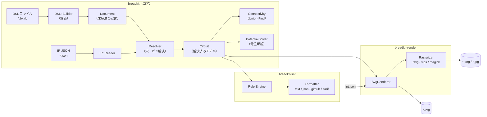

# Breadkit 設計書

ブレッドボード配線 DSL / レンダラー / リンター

| 項目 | 内容 |
|---|---|
| 文書種別 | 設計書 |
| 対象 | `breadkit`（コア）、`breadkit-render`（画像化 CLI）、`breadkit-lint`（静的検査 CLI） |
| 版 | 0.1（初版ドラフト） |
| 対象 Ruby | 3.3 以上 |

> **名称について**：`breadkit` は仮称です。2026年9月時点で `breadkit` / `breadkit-render` / `breadkit-lint` はいずれも RubyGems 上で未使用（API が 404）でしたが、公開直前に再確認してください（作業手順書 Phase 0 参照）。

---

## 目次

1. [概要](#1-概要)
2. [全体構成](#2-全体構成)
3. [DSL 仕様](#3-dsl-仕様)
4. [コア（breadkit）設計](#4-コアbreadkit設計)
5. [レンダラー（breadkit-render）設計](#5-レンダラーbreadkit-render設計)
6. [リンター（breadkit-lint）設計](#6-リンターbreadkit-lint設計)
7. [レンダラーとリンターの連携](#7-レンダラーとリンターの連携)
8. [非機能要件](#8-非機能要件)
9. [テスト方針](#9-テスト方針)
10. [バージョニングと互換性](#10-バージョニングと互換性)
11. [設計判断記録（ADR）](#11-設計判断記録adr)
12. [ロードマップ](#12-ロードマップ)

---

## 1. 概要

### 1.1 目的

ブレッドボード上の配線案をテキスト（DSL）で記述し、次の2つを実現する。

1. **可視化**：DSL から配線図を画像（SVG / PNG / JPEG）として生成する。
2. **静的検査**：ショート、未接続ピン、浮いたワイヤ、分割レールの渡し忘れ、LED の電流制限抵抗忘れなどを、部品を挿す前に検出する。

配線案がテキストになることで、Git による差分管理、Pull Request でのレビュー、CI での自動検査が可能になる。

### 1.2 スコープ

| 区分 | 内容 |
|---|---|
| 対象（v1） | ソルダーレスブレッドボード（830穴フル / 400穴ハーフ / 170穴ミニ、および YAML で定義した任意のボード）、ジャンパワイヤ、リード部品（抵抗・LED・コンデンサ・ダイオード・トランジスタ等）、DIP IC、タクトスイッチ、ボード外モジュール（Arduino 等）への配線、直流電源の静的解析 |
| 対象外（v1） | 回路シミュレーション（電流・過渡解析）、自動配置・自動配線、PCB 出力、GUI エディタ |

### 1.3 用語

| 用語 | 意味 |
|---|---|
| 穴（Hole / タイポイント） | 部品のリードやワイヤを挿す穴。`a10`、`T+5` のような ID で表す |
| ストリップ（Strip） | ボード内部で導通している穴の集合。端子部の「同じ列の a〜e」、電源レールの導通区間など |
| 中央溝（Ravine） | 端子部の e 行と f 行の間の溝。DIP IC はここをまたいで挿す |
| 電源レール（Rail） | ボード上下の長い導通列。`T+` / `T-` / `B+` / `B-` |
| ネット（Net） | 電気的に導通している接続点の集合（ストリップ・ワイヤ・部品内部接続を合成した結果） |
| ピン（Pin） | 部品の端子。`R1.1`、`D1.anode`、`U1.8` のように参照する |
| フットプリント | 足の相対位置が固定された部品（DIP、タクトスイッチ等）の配置パターン |
| IR | Intermediate Representation。解決済み回路の JSON 表現。gem 間・外部ツールとの契約 |
| オフェンス（Offense） | リンターが検出した個々の問題 |
| 状態（State） | スイッチの開閉の組み合わせ。電気的検査は状態ごとに行う |

---

## 2. 全体構成

### 2.1 Gem 構成

公開したい gem はレンダラーとリンターの2つだが、DSL の解釈と接続解析は両者で完全に共通であるため、**共通コア gem を切り出した3 gem 構成**とする（理由は [ADR-002](#adr-002-3-gem-構成共通コアを切り出す)）。利用者は `gem install breadkit-render breadkit-lint` とすればコアは依存として自動で入る。

| Gem | 役割 | 実行ファイル | 実行時依存 |
|---|---|---|---|
| `breadkit` | DSL 評価、ボード/パーツ定義、配置解決、接続解析（ネットリスト）、電位解析、IR 入出力 | `breadkit`（IR 出力・ネット一覧などのデバッグ用） | 標準ライブラリのみ |
| `breadkit-render` | SVG 生成、ラスタ変換（PNG / JPEG）、CLI | `bkrender` | `breadkit`（任意で `ruby-vips`） |
| `breadkit-lint` | ルールエンジン、組み込みルール、設定、出力フォーマッタ、CLI | `bklint` | `breadkit` |

### 2.2 アーキテクチャ



### 2.3 処理パイプライン

1. **評価（Load）**：DSL ファイルを `DSL::Builder` 上で評価し、宣言（ボード、部品、ワイヤ、電源、ラベル、期待接続）とそのソース位置を `Document` に記録する。この時点では穴 ID の妥当性は検証しない（前方参照を許すため）。
2. **解決（Resolve）**：ボード定義とパーツ定義を読み込み、各ピン・ワイヤ端を具体的な穴に割り付ける。自動選択（レール番号省略など）もここで確定する。問題は例外ではなく `Diagnostic` として蓄積し、可能な限り処理を続行する。
3. **解析（Analyze）**：Union-Find でネットを構築し、電源制約から各ネットの電位を求める。スイッチがある場合は状態ごとに行う（遅延評価・メモ化）。
4. **出力**：レンダラーは `Circuit` から SVG を生成し、必要ならラスタ変換する。リンターは `Circuit` にルールを適用してオフェンスを出力する。

### 2.4 リポジトリ構成

```text
 breadkit/breadkit/               # コア gem の GitHub リポジトリ
 ├── breadkit.gemspec
 ├── exe/breadkit
 ├── data/                        # ボード・パーツ定義
 ├── lib/breadkit/                # DSL・解決・解析・IR
 ├── docs/                        # DSL と設計の文書
 ├── examples/                    # 共通の DSL 例題
 └── .github/workflows/           # コア単体の CI とリリース

 breadkit/breadkit-render/        # レンダラー gem の GitHub リポジトリ
 ├── breadkit-render.gemspec
 ├── exe/bkrender
 ├── lib/breadkit/render/
 └── .github/workflows/           # レンダラー単体の CI とリリース

 breadkit/breadkit-lint/          # リンター gem の GitHub リポジトリ
 ├── breadkit-lint.gemspec
 ├── exe/bklint
 ├── config/  locales/  docs/rules/
 ├── lib/breadkit/lint/
 └── .github/workflows/           # リンター単体の CI とリリース
```

3つのリポジトリは同じ作業ディレクトリの隣同士に clone する。レンダラーとリンターの開発用 Gemfile は `../breadkit` を参照する。

名前空間は `Breadkit`（コア）、`Breadkit::Render`、`Breadkit::Lint` とし、RubyGems の命名慣習（ハイフン＝名前空間の拡張）に合わせる。

---

## 3. DSL 仕様

### 3.1 方針

- **Ruby 内部 DSL** とする（Gemfile / Vagrantfile と同じ形式）。ループや変数で繰り返し配線を簡潔に書けることを重視する（[ADR-001](#adr-001-ruby-内部-dsl-を採用する)）。
- 拡張子は `*.bk.rb`。`.rb` で終わるためエディタのシンタックスハイライトや Ruby LSP がそのまま効く。
- データのみの安全な入力経路として、IR JSON（`*.json`）も両 CLI の入力に受け付ける（[3.6](#36-ir-json)）。
- 宣言の順序は自由（前方参照可）。解決は評価後にまとめて行う。

### 3.2 記述例

```ruby
# examples/01_led_button.bk.rb
title "押しボタンで LED を点灯"
board :half                                   # 400穴ハーフサイズ

# 外部電源（USB 5V）を下側レールに接続
supply :USB, voltage: 5.0, plus: "B+1", minus: "B-1"
net :VCC, at: "B+1"
net :GND, at: "B-1"

# 部品
button   :SW1, at: "e10"                      # 中央溝をまたぐ 4 ピンのタクトスイッチ
resistor :R1, "330", pins: %w[a12 a16]
led      :D1, color: :red, anode: "b16", cathode: "b17"

# 配線
wire "a10", "B+", color: :red                 # レール番号省略 → 最寄りの空き穴を自動選択
wire "a17", "B-", color: :black

# 設計意図（リンターが実配線と突き合わせる）
expect do
  connected "SW1.1", :VCC
  connected "SW1.3", "R1.1"
  connected "R1.2", "D1.anode"
  connected "D1.cathode", :GND
  isolated  :VCC, :GND
end
```

この例では、SW1 を押すと `VCC → SW1 → R1(330Ω) → D1 → GND` の経路ができる。`wire "a10", "B+"` のレール穴は列10に最も近い `B+8` に解決される（[4.4](#44-配置解決resolver)）。

### 3.3 座標系と穴 ID

ボードは「列番号が左→右に増え、行 `a` が下、行 `j` が上」の向きを基準とする（Fritzing や多くの市販品の印字と同じ向き）。

| 種別 | 書式 | 例 | 備考 |
|---|---|---|---|
| 端子部の穴 | `<行><列>` | `a1`, `j63` | 行は `a`〜`j`（大文字も可、内部では小文字に正規化） |
| 電源レールの穴 | `<T\|B><+\|-><番号>` | `T+5`, `B-12` | `T`=上側、`B`=下側。番号はレール上の穴番号（1始まり） |
| 電源レール（番号省略） | `<T\|B><+\|->` | `T+`, `B-` | 相手側の位置に最も近い空き穴を自動選択 |
| 部品ピン | `<部品記号>.<ピン番号 or ピン名>` | `R1.1`, `D1.anode`, `U1.8`, `U1.VCC` | ワイヤ端に使うと「そのピンと同じストリップの空き穴」を自動選択 |
| ボード外ピン | `<モジュール名>.<ピン名>` | `UNO.D13` | ボード外モジュールのピンそのもの |
| 電源端子 | `<電源名>.+` / `<電源名>.-` | `USB.+` | `expect` などでの参照用 |

### 3.4 DSL リファレンス

#### トップレベル

| メソッド | 引数 | 説明 |
|---|---|---|
| `title` | `String` | 図のタイトル。SVG の `<title>` と描画に使う |
| `board` | `Symbol`（`:full` / `:half` / `:mini` / 定義ID）, `split_rails: false`, `**opts` | ボードを選ぶ。1ファイル1回のみ |
| `use_parts` | glob `String` | 追加のパーツ定義 YAML を読み込む（例：`use_parts "./parts/*.yml"`） |
| `use_boards` | glob `String` | 追加のボード定義 YAML を読み込む |
| `supply` | `name`, `voltage:`, `plus:`, `minus:` | 外部直流電源。`plus` / `minus` は穴 ID（電源の端子が穴を1つ占有する） |
| `net` | `name`, `at:` | 穴またはピンを含むネットに名前を付ける |
| `part` | `ref`, `type`, `value = nil`, `pins:` / `at:`, `**attrs` | 汎用の部品配置。以下のショートハンドはすべてこれに展開される |
| `wire` | `from`, `to`, `color: nil`, `id: nil`, `route: :straight` | ジャンパワイヤ。`route: :arc` で弧を描いて描画 |
| `offboard` | `name`, `type`, `side: :left` | ボード外モジュール（Arduino 等）を配置 |
| `expect` | `strict: false` とブロック | 設計意図の宣言（下記） |
| `lint_disable` | `rule_id`, `on: nil`, `reason: nil` | 特定ルールを抑制（`on:` で対象を限定） |

#### 部品ショートハンド

| メソッド | 例 | 配置方式 |
|---|---|---|
| `resistor` | `resistor :R1, "4.7k", pins: %w[a5 a9]` | リード（2ピン） |
| `capacitor` | `capacitor :C1, "100n", pins: %w[c3 c5]` | リード（無極性） |
| `electrolytic` | `electrolytic :C2, "10u", plus: "d20", minus: "d22"` | リード（有極性） |
| `diode` | `diode :D2, "1N4148", anode: "b3", cathode: "b7"` | リード（有極性） |
| `led` | `led :D1, color: :red, anode: "b16", cathode: "b17"` | リード（有極性） |
| `transistor` | `transistor :Q1, "2N3904", e: "a30", b: "a31", c: "a32"` | リード（ピン順はパーツ定義） |
| `pot` | `pot :VR1, "10k", at: "a40"` | フットプリント |
| `button` | `button :SW1, at: "e10", rotate: 0` | フットプリント（中央溝をまたぐ） |
| `ic` | `ic :U1, "NE555", at: "e20", unused: [5]` | DIP（1番ピンの穴を指定） |

共通オプション：`pins:` は配列（ピン番号順）またはハッシュ（`{ anode: "b16", cathode: "b17" }`）。有極性部品はピン名のキーワード引数でも指定できる。`unused:` に列挙したピンは未接続でも警告しない。

#### 値の表記

`"220"`, `"4.7k"`, `"4k7"`（RKM 表記）, `"1M"`, `"100n"`, `"10u"`, `"10uF"`, `"4.7kΩ"` を受け付け、SI 基本単位の数値に正規化する。抵抗のカラーコード描画や表示に使う。

#### DIP IC のピン割付

`ic :U1, "NE555", at: "e20"` は **1番ピンを e20 に置く**。上から見てピン番号が反時計回りになるよう、次の規則で自動割付する。

- 1番ピンが **e 行** のとき：e 行を列の昇順に 1〜n/2、折り返して f 行を列の降順に n/2+1〜n（切り欠きは左）
- 1番ピンが **f 行** のとき：f 行を列の降順に 1〜n/2、折り返して e 行を列の昇順に n/2+1〜n（切り欠きは右）
- それ以外の行を指定した場合は `Layout/InvalidPlacement`（中央溝をまたげない）

NE555 を `at: "e20"` に置いた場合：

| ピン | 名前 | 穴 | ピン | 名前 | 穴 |
|---|---|---|---|---|---|
| 1 | GND | e20 | 8 | VCC | f20 |
| 2 | TRIG | e21 | 7 | DIS | f21 |
| 3 | OUT | e22 | 6 | THR | f22 |
| 4 | RESET | e23 | 5 | CTRL | f23 |

#### 設計意図（`expect`）

```ruby
expect do
  connected "U1.8", "U1.4", :VCC     # すべて同一ネットであること
  connected "U1.2", "U1.6"
  isolated  :VCC, :GND                # 互いに別ネットであること
end

expect strict: true do                # strict: 全ピンのネット所属を完全一致で照合（簡易 LVS）
  net :VCC, "U1.8", "U1.4", "R1.1"
  net :GND, "U1.1", "C1.2", "C2.2", "D1.cathode"
  # ...
end
```

`strict: true` では宣言されていないピンが既存ネットに接続されている場合や、宣言したネットが分断されている場合もオフェンスになる。回路図（意図）と実配線（レイアウト）の照合、いわば簡易的な LVS（Layout versus Schematic）として機能する。

#### Ruby の機能を使った記述

```ruby
# LED 4 連：変数とループで繰り返し配置
4.times do |i|
  col = 5 + i * 4
  led      :"D#{i + 1}", anode: "c#{col}", cathode: "c#{col + 1}"
  resistor :"R#{i + 1}", "220", pins: ["a#{col + 1}", "B-"]
end

# ボード外モジュールへの配線
offboard :UNO, "arduino_uno", side: :left
wire "UNO.D13", "a5", color: :yellow
wire "UNO.GND", "B-", color: :black
```

### 3.5 評価の仕組み

- `Breadkit::DSL::Builder#instance_eval(File.read(path), path, 1)` で評価する。ファイル名と行番号を渡すことで、例外のバックトレースと `caller_locations` が DSL ファイルを指す。
- 各 DSL メソッドは `caller_locations` から DSL ファイル上の呼び出し行を探して `SourceLocation(path, line)` を記録する。ループ内の宣言も正しい行を指す。
- 未知のメソッドは `method_missing` で捕捉し、`DidYouMean::SpellChecker` で候補を提示して `Breadkit::DSLError` を送出する（例：`registor` → `resistor`）。
- Builder は内部状態を公開しないよう、DSL メソッド以外を private にする。

### 3.6 IR JSON

解決済みの `Circuit` を表す JSON。gem 間の受け渡し、外部ツール連携、そして「Ruby コードを実行しない安全な入力経路」として使う。

```json
{
  "schema_version": 1,
  "title": "押しボタンで LED を点灯",
  "board": { "type": "half", "options": { "split_rails": false } },
  "supplies": [
    { "name": "USB", "voltage": 5.0, "plus": "B+1", "minus": "B-1", "source": { "line": 6 } }
  ],
  "labels": [ { "net": "VCC", "at": "B+1" }, { "net": "GND", "at": "B-1" } ],
  "components": [
    { "ref": "SW1", "part": "tact_switch_6mm",
      "pins": { "1": "e10", "2": "f10", "3": "e12", "4": "f12" }, "source": { "line": 11 } },
    { "ref": "R1", "part": "resistor", "value": "330",
      "pins": { "1": "a12", "2": "a16" }, "source": { "line": 12 } },
    { "ref": "D1", "part": "led", "attrs": { "color": "red" },
      "pins": { "anode": "b16", "cathode": "b17" }, "source": { "line": 13 } }
  ],
  "wires": [
    { "id": "W1", "from": "a10", "to": "B+8", "color": "red", "source": { "line": 16 } },
    { "id": "W2", "from": "a17", "to": "B-14", "color": "black", "source": { "line": 17 } }
  ],
  "expectations": [ { "kind": "connected", "refs": ["SW1.1", "VCC"], "source": { "line": 21 } } ],
  "analysis": {
    "nets": [
      { "name": "VCC", "members": ["USB.+", "W1", "SW1.1", "SW1.2"], "potential": 5.0 },
      { "name": "N1",  "members": ["SW1.3", "SW1.4", "R1.1"], "potential": null },
      { "name": "N2",  "members": ["R1.2", "D1.anode"], "potential": null },
      { "name": "GND", "members": ["USB.-", "W2", "D1.cathode"], "potential": 0.0 }
    ]
  }
}
```

- IR には**自動選択の結果を確定した穴 ID**（`B+8` など）を書く。IR を入力した場合は再選択しない。
- `analysis` は出力専用（参考情報）。入力時は無視し、必ず再計算する。
- スキーマは `breadkit/schema/ir-v1.json`（JSON Schema）として同梱し、`schema_version` の互換性ルールは [10](#10-バージョニングと互換性) に従う。

---

## 4. コア（breadkit）設計

### 4.1 主要クラス

| クラス | 責務 |
|---|---|
| `Breadkit::DSL::Builder` | DSL を評価し `Document` を構築する |
| `Breadkit::Document` | 未解決の宣言とソース位置の集合 |
| `Breadkit::BoardDef` / `Breadkit::Board` | ボード定義 YAML を読み込み、`Hole` と `Strip` を生成する |
| `Breadkit::Hole` | `id`, `kind`（`:terminal` / `:rail`）, `row`, `col`, `rail`, `x`, `y`（ピッチ単位）, `strip_id` |
| `Breadkit::Strip` | 導通する穴の集合（端子部の半列5穴、レールの導通区間） |
| `Breadkit::PartDef` / `Breadkit::PartLibrary` | パーツ定義の読み込み、ID・別名での検索 |
| `Breadkit::Resolver` | `Document` → `Circuit`。穴 ID 解釈、フットプリント展開、自動選択、占有チェック |
| `Breadkit::Component` / `Pin` / `Wire` / `Supply` / `Label` / `Expectation` | 解決済みの要素（イミュータブル） |
| `Breadkit::Analysis::Connectivity` | Union-Find によるネット構築（状態ごと） |
| `Breadkit::Analysis::PotentialSolver` | 電源制約から各ネットの電位を求め、矛盾（短絡）を検出する |
| `Breadkit::Analysis::State` | スイッチの開閉状態 |
| `Breadkit::Net` | `name`, `members`（ピン・ワイヤ・電源端子）, `holes`, `labels` |
| `Breadkit::Circuit` | 上記を束ねた読み取り専用モデル。解析結果は状態ごとにメモ化 |
| `Breadkit::Diagnostic` | 構築時の問題（`code`, `severity`, `message`, `location`, `targets`） |
| `Breadkit::IR::Writer` / `Reader` | `Circuit` と JSON の相互変換 |
| `Breadkit::Value` | `"4.7k"` などの値パーサと整形 |

### 4.2 ボード定義

ボードはデータ（YAML）として定義し、コードを変更せずに追加できるようにする。

```yaml
# breadkit/data/boards/half.yml
id: half
name: "Half-size breadboard (400 tie points)"
terminal:
  columns: 30
  rows: [a, b, c, d, e, f, g, h, i, j]   # 下から上
  groups:                                 # 同じ列で導通する行のまとまり
    - [a, b, c, d, e]
    - [f, g, h, i, j]
  ravine_between: [e, f]                  # e-f間を3ピッチにして中央溝を表す
rails:
  - { id: "T+", side: top,    order: 0 }  # order 0 = 端子部に近い側
  - { id: "T-", side: top,    order: 1 }
  - { id: "B+", side: bottom, order: 1 }
  - { id: "B-", side: bottom, order: 0 }
rail_layout:
  holes: 25
  group_size: 5          # 5穴ごとに1ピッチの隙間
  start_column: 2        # 1番穴の x 位置を端子部の何列目に揃えるか
  segments: [[1, 25]]    # 導通区間
```

レール穴 `i`（1始まり）の x 位置は `start_column + (i - 1) + floor((i - 1) / group_size)` で求める。ハーフボードでは `B+8` が列10、`B-14` が列17 の位置になる。

`ravine_between` に隣接する行の組を指定すると、物理座標に2ピッチ分の溝が入る。行IDと導通グループの対応は変わらない。

| ボード | 端子部 | レール | 備考 |
|---|---|---|---|
| `full` | 63列 × 10行 | 4本 × 50穴（`start_column: 3`） | `split_rails: true` で `segments: [[1,25],[26,50]]` に切り替え（中央で分断されている製品向け） |
| `half` | 30列 × 10行 | 4本 × 25穴 | |
| `mini` | 17列 × 10行 | なし | |

寸法・分断位置は製品により異なるため、利用者は `use_boards` で独自定義を追加できる。

### 4.3 パーツ定義

パーツもデータ（YAML）で定義する。配置方式（`placement`）は3種類。

| placement | 意味 | 例 |
|---|---|---|
| `leads` | 足が曲げられ、各ピンを任意の穴に挿せる | 抵抗、LED、コンデンサ、トランジスタ |
| `dip` | DIP パッケージ。1番ピンの穴から自動割付 | NE555、74HC595、ATtiny85 |
| `footprint` | 足の相対位置が固定 | タクトスイッチ、半固定抵抗 |

```yaml
# breadkit/data/parts/led.yml
id: led
category: diode
placement: leads
pins:
  - { num: 1, name: anode,   aliases: [a, "+"] }
  - { num: 2, name: cathode, aliases: [k, "-"] }
polarity: { positive: anode, negative: cathode }
flags: [needs_series_resistor]
render: { shape: led_5mm }
```

```yaml
# breadkit/data/parts/ne555.yml
id: ne555
aliases: ["NE555", "555"]
category: ic
placement: dip
package: { pins: 8 }
pins:
  - { num: 1, name: GND,   role: ground }
  - { num: 2, name: TRIG }
  - { num: 3, name: OUT }
  - { num: 4, name: RESET }
  - { num: 5, name: CTRL }
  - { num: 6, name: THR }
  - { num: 7, name: DIS }
  - { num: 8, name: VCC,   role: power }
supply_range: [4.5, 16.0]   # 電源電圧の許容範囲 [V]
render: { shape: dip, label: "NE555" }
```

```yaml
# breadkit/data/parts/tact_switch_6mm.yml
id: tact_switch_6mm
aliases: [button]
category: switch
placement: footprint
pins:
  - { num: 1 }
  - { num: 2 }
  - { num: 3 }
  - { num: 4 }
footprint:          # アンカー（1番ピン）からの相対位置 [列オフセット, 行オフセット]
  1: [0, 0]
  2: [0, 3]         # 物理ピッチ +3 = 中央溝の反対側（e → f）
  3: [2, 0]
  4: [2, 3]
internal:           # 常時導通しているピンの組
  - [1, 2]
  - [3, 4]
switch:             # 押下時に導通するピンの組
  - [1, 3]
render: { shape: tact_switch }
```

| キー | 用途 |
|---|---|
| `pins[].role` | `power` / `ground`。`Electrical/PowerPinUnconnected` と `Electrical/SupplyVoltageRange` が使う |
| `polarity` | 有極性部品の正負ピン。`Electrical/ReversePolarity` が使う |
| `flags` | `needs_series_resistor` など、ルールが参照する性質 |
| `internal` | 部品内部で常時導通しているピンの組（接続解析で結合する） |
| `switch` | 操作時のみ導通するピンの組（状態ごとの解析で結合する） |
| `same_strip_ok` | 同一ストリップに挿してよいピンの組（`Layout/PinsInSameStrip` の例外） |
| `supply_range` | 電源電圧の許容範囲 |

> タクトスイッチの内部導通の向きは製品によって異なる場合がある。定義は代表的な 6mm 角品を想定した例であり、実物はテスターで確認し、必要なら独自定義を `use_parts` で読み込む運用とする。

### 4.4 配置解決（Resolver）

`Resolver#call(document) → Circuit` は次の順で処理する。問題は `Diagnostic` に積み、処理は可能な限り継続する。

1. **ボード生成**：ボード定義とオプション（`split_rails`）から `Hole` / `Strip` を生成する。
2. **参照名チェック**：部品記号・ワイヤ ID・電源名の重複を検出する（`duplicate_ref`）。
3. **パーツ定義の解決**：ID または別名で検索する（`unknown_part`）。
4. **明示指定の割付**：穴 ID を直接指定したピン・ワイヤ端・電源端子をすべて割り付け、占有表に登録する（`invalid_hole`、`invalid_placement`、`hole_conflict`）。
5. **自動選択の割付**：宣言順に、番号省略のレール指定とピン参照のワイヤ端を解決する。明示指定を先に確定させることで、宣言順によって結果が揺れないようにする。
   - レール番号省略（`"B+"`）：もう一方の端の x 位置に最も近い空き穴。同距離なら番号の小さい方。
   - ピン参照（`"U1.3"`）：そのピンと同じストリップ内で、もう一方の端に最も近い空き穴。
   - 空き穴がない場合は `no_free_hole`。
6. **ラベル・期待接続の参照解決**：`net ... at:` と `expect` 内の参照先の存在を確認する（`unknown_pin`、`unknown_net`）。

| Diagnostic コード | 重大度 | 例 | 対応するリンタールール |
|---|---|---|---|
| `invalid_hole` | error | `k5`、`a64`、`T+60` | `Layout/InvalidHole` |
| `unknown_part` | error | `ic :U1, "NE556X"` | `Layout/UnknownPart` |
| `unknown_pin` | error | `D1.anod`、`UNO.D14` | `Layout/UnknownPin` |
| `duplicate_ref` | error | `R1` を2回定義 | `Layout/DuplicateRef` |
| `invalid_placement` | error | DIP の1番ピンが e/f 行以外、フットプリントが盤外にはみ出す | `Layout/InvalidPlacement` |
| `hole_conflict` | error | 1つの穴にリードが2本 | `Layout/HoleConflict` |
| `no_free_hole` | error | 自動選択できる空き穴がない | `Layout/NoFreeHole` |
| `unknown_net` | error | `expect` で未定義のネット名を参照 | `Intent/UnknownNet` |

`Diagnostic` はコアの概念で、リンターはこれを同名ルールのオフェンスとして報告する。レンダラーは error がある場合は描画を中止する（`--force` 指定時は解決できた要素だけ描画し、問題箇所に印を付ける）。

### 4.5 接続解析（Connectivity）

ノードは「穴」「部品ピン」「ワイヤ」「電源端子」「ボード外ピン」とし、Union-Find で結合する。

```ruby
def build(state)
  uf = UnionFind.new
  board.strips.each { |s| s.hole_ids.each_cons(2) { |a, b| uf.union(a, b) } }

  components.each do |c|
    c.pins.each { |p| uf.union(p.node_id, p.hole_id) if p.hole_id }   # ボード外ピンは穴なし
    c.part.internal.each { |a, b| uf.union(c.pin(a).node_id, c.pin(b).node_id) }
  end
  wires.each    { |w| uf.union(w.node_id, w.from_node); uf.union(w.node_id, w.to_node) }
  supplies.each { |s| uf.union(s.plus_node, s.plus_hole); uf.union(s.minus_node, s.minus_hole) }

  state.closed_switches.each do |comp, (a, b)|
    uf.union(comp.pin(a).node_id, comp.pin(b).node_id)
  end

  group_into_nets(uf)   # 端点（ピン・ワイヤ・電源端子・ラベル）を含むグループだけをネットにする
end
```

**ネット名の決定（決定的であること）**

1. ラベル（`net :VCC, at:`）が1つだけ付いていればその名前。複数の異なるラベルが付いていれば先に宣言された方を採用し、`Electrical/NetLabelConflict` の材料として記録する。
2. ラベルがなく電源端子を含む場合は `<電源名>+` / `<電源名>-`。
3. それ以外は、ネットに含まれる穴の最小位置（列→行の順）で並べて `N1`, `N2`, … を振る。図を左から見た順になり、同じ入力からは常に同じ名前になる。

### 4.6 電位解析（PotentialSolver）

各電源を「`minus` ネットから `plus` ネットへ `+V` の制約辺」とみなし、ネット間のグラフを幅優先探索して電位を割り当てる。

```text
for each 連結成分 in 電源制約グラフ:
  基準ネットを選ぶ（"GND" ラベルのネット > 最初に宣言された電源の minus ネット）
  potential[基準] = 0.0
  BFS:
    辺 (minus → plus, V) をたどるとき potential[plus] = potential[minus] + V
    逆向きにたどるとき           potential[minus] = potential[plus] - V
    既に値があり |差| > 1e-9 なら Conflict(net, 既存値, 新値, 関与した電源) を記録
```

- `Conflict` は短絡（電位の異なる電源端子が同一ネットにある状態）を意味する。電源の `+` と `-` が同じネットにある場合も `V ≠ 0` のため必ず矛盾になる。
- 電源制約グラフの連結成分が複数ある場合（電源どうしの GND が共通化されていない）、成分ごとの電位は相対値となる。これは `Electrical/NoCommonGround` の判定材料になる。
- 電源に直接つながらないネットの電位は `nil`（不明）。抵抗経由の電位推定は v1 では行わない（[12](#12-ロードマップ)）。

**短絡経路の提示**：矛盾を検出したら、関与する2つの電源端子間の最短経路を「穴・ワイヤ・内部接続」のグラフ上で幅優先探索し、`経路: B+3 → W4 → a10 … → B-2` のように提示する。誤りの箇所を利用者がすぐ特定できるようにするための重要な機能である。

### 4.7 スイッチ状態

電気的な検査はスイッチの開閉状態ごとに行う。`Circuit#states(mode)` が状態を列挙し、接続解析と電位解析は状態ごとにメモ化する。

| mode | 列挙する状態 | 用途 |
|---|---|---|
| `none` | 全開のみ | スイッチを考慮しない |
| `single`（既定） | 全開 ＋ 各スイッチを1つずつ閉じた状態 | 実用上十分で、状態数はスイッチ数+1 |
| `all` | 全組み合わせ（2^n）。n > 8 の場合は `single` ＋ 全閉に縮退 | 厳密な確認 |

### 4.8 公開 API

```ruby
circuit = Breadkit.load("examples/01_led_button.bk.rb")   # DSL または IR JSON を自動判別
circuit.diagnostics          # => [Breadkit::Diagnostic, ...]
circuit.nets                 # => 全開状態のネット
circuit.nets(state)          # => 指定状態のネット
circuit.potentials(state)    # => { "VCC" => 5.0, "GND" => 0.0, "N1" => nil, ... }
circuit.net_of("D1.anode")   # => #<Breadkit::Net name="N2" ...>
circuit.to_ir                # => Hash（JSON.generate 可能）

# 段階的に使う場合
doc     = Breadkit::DSL.load_file(path)       # => Breadkit::Document
circuit = Breadkit::Resolver.new.call(doc)    # => Breadkit::Circuit
```

コア gem の CLI（`breadkit`）はデバッグ用途に限定する。

```text
breadkit ir   FILE            # 解決済み IR を JSON で標準出力へ
breadkit nets FILE [--state SW1]   # ネット一覧を表示
breadkit parts                # 利用可能なパーツ定義の一覧
```

---

## 5. レンダラー（breadkit-render）設計

### 5.1 CLI

```text
bkrender [options] INPUT

  -o, --output PATH          出力先。拡張子（.svg / .png / .jpg / .jpeg）で形式を判定
  -f, --format FORMAT        svg | png | jpeg（-o 省略時は SVG を標準出力へ）
      --scale N              ラスタ倍率（既定 2.0）
      --theme NAME           light | dark | print（既定 light）
      --color-by MODE        wire | net（既定 wire：明示色 > 自動配色）
      --show-nets            ネット名ラベルを表示
      --legend               ネット凡例を表示
      --crop MODE            auto | none（既定 auto：使用範囲＋余白のみ切り出し）
      --annotations FILE     bklint --format json の結果を重ねて描画
      --backend NAME         auto | rsvg | vips | magick（既定 auto）
      --background COLOR     背景色（JPEG の既定は white、PNG/SVG は透過）
      --quality N            JPEG 品質（既定 90）
      --force                診断エラーがあっても描画できる範囲で出力
  -v, --version
  -h, --help
```

| 終了コード | 意味 |
|---|---|
| 0 | 成功 |
| 1 | 入力に error レベルの診断があり描画を中止した |
| 2 | 使い方の誤り、DSL の評価エラー、ラスタ変換バックエンドが見つからない等 |

使用例：

```sh
bkrender examples/01_led_button.bk.rb -o led.svg
bkrender examples/01_led_button.bk.rb -o led.png --scale 3 --legend
bklint examples/02_555_blinker.bk.rb -f json > lint.json
bkrender examples/02_555_blinker.bk.rb -o review.png --annotations lint.json
```

### 5.2 座標系と寸法

- 内部座標はピッチ単位（1ピッチ = 2.54mm）で保持し、SVG 出力時に `1ピッチ = 10 ユーザー単位` へ変換する。
- `viewBox` はボード全体（`--crop none`）または使用範囲＋2ピッチ余白（`--crop auto`）。
- ラスタ出力の既定は `--scale 2`（1ピッチ = 20px）。フルボード全体で横幅およそ 1,400px。
- 座標値は小数第2位で丸めて出力する（スナップショットテストの安定化）。

### 5.3 描画レイヤ

SVG は次の順に `<g>` を重ねる。各要素には `data-ref`、`data-net`、`data-hole` 属性を付け、将来のインタラクティブ表示やアノテーションの対応付けに使う。

| 順 | レイヤ（`<g id>`） | 内容 |
|---|---|---|
| 1 | `board` | 基板、中央溝、レールの赤青ライン |
| 2 | `holes` | 穴（空き穴と使用穴で濃さを変える） |
| 3 | `labels` | 列番号、行記号、レール記号 |
| 4 | `components` | 部品本体とリード |
| 5 | `wires` | ジャンパワイヤ（既定で部品の上。`wire_layer: below` で下に） |
| 6 | `offboard` | ボード外モジュールと引き出し線 |
| 7 | `nets` | ネット名ラベル（`--show-nets`） |
| 8 | `annotations` | リント結果のマーカー（`--annotations`） |
| 9 | `legend` | 凡例・タイトル |

### 5.4 部品の描画

部品の形状ごとに `PartRenderer` を実装し、パーツ定義の `render.shape` で選択する。未知の形状は汎用の矩形＋ピン名で描く（`GenericRenderer`）ため、パーツ定義を追加しただけでも必ず何かが描かれる。

| shape | 描画内容 |
|---|---|
| `resistor` | ベージュの胴体＋カラーバンド（値から4本帯を算出。例：330 → 橙・橙・茶・金） |
| `led_5mm` | 色付きの円（`color:` 属性）、カソード側に平らな切り欠き、長い足＝アノード |
| `capacitor` / `electrolytic` | 円板 / 円筒上面、電解はマイナス側に帯 |
| `diode` | 黒い胴体＋カソード帯 |
| `to92` | D 字形状と品番 |
| `dip` | 黒い矩形、1番ピン側の切り欠き、品番ラベル、ピン名（小さく） |
| `tact_switch` | 正方形＋円形ボタン |
| `pot` | 円形ノブ |
| `offboard` | 角丸矩形とピン名の列、ボードの `side` 側に配置 |

2ピンのリード部品は2つの穴の中点に胴体を置き、2点を結ぶ方向に回転させる。穴間が狭い場合は胴体を縮小せず「立て挿し」表現（円＋片側リード）に切り替える。

### 5.5 ワイヤの描画

- 線幅 0.6 ピッチ、丸い端点、両端の穴に小さな端子マーカー。
- `route: :straight`（既定）は直線、`route: :arc` は交差を避けるための緩い二次ベジェ曲線。
- 色の決定順：DSL の `color:` → `--color-by net` 時はネット色（電位 > 0 の電源ネット＝赤、0V＝黒、その他はネット名のハッシュから決定的に選ぶパレット） → 既定パレットを宣言順に巡回。
- テーマ `print` ではグレースケール＋破線パターンでネットを区別する。

### 5.6 ラスタ変換

SVG をコアの出力とし、PNG / JPEG は外部のラスタライザに任せる（[ADR-003](#adr-003-svg-を一次出力としラスタ変換は外部バックエンドに委ねる)）。いずれのバックエンドも gem の必須依存にはせず、実行時に検出する。

| バックエンド | 実体 | PNG | JPEG | 備考 |
|---|---|---|---|---|
| `rsvg` | `rsvg-convert` コマンド（librsvg） | ✓ | ✗ | 高品質・軽量。PNG の第一候補 |
| `vips` | `ruby-vips` gem（libvips） | ✓ | ✓ | libvips が librsvg 付きでビルドされている必要がある |
| `magick` | `magick`（IM7）/ `convert`（IM6）コマンド | ✓ | ✓ | SVG の描画品質は環境の delegate に依存 |

```ruby
module Breadkit::Render::Rasterizer
  class Base
    def self.available? = raise NotImplementedError
    def self.supports?(format) = raise NotImplementedError
    # @return [String] バイナリ
    def rasterize(svg, format:, scale:, background:, quality:) = raise NotImplementedError
  end
end
```

- `auto` の選択順：PNG は `rsvg` → `vips` → `magick`、JPEG は `vips` → `magick`。
- JPEG は透過を持てないため、必ず背景色で平坦化する（既定 white）。
- 外部コマンドは `Open3.capture3` で起動し、SVG は標準入力から渡す（一時ファイルを作らない）。シェルを介さず引数配列で渡す。
- バックエンドが1つも見つからない場合は、OS ごとのインストール例（`apt install librsvg2-bin`、`brew install librsvg` など）を含むエラーメッセージを出して終了コード 2 で終える。

### 5.7 SVG 出力の要件

- 出力は決定的（同じ入力から常にバイト単位で同一）。タイムスタンプや乱数を含めない。
- 自前の最小 XML ビルダーで生成し、テキストは必ずエスケープする。
- `<title>` と `<desc>` を入れる（アクセシビリティ、ファイルプレビュー用）。
- フォントは `font-family="Helvetica, Arial, 'Noto Sans JP', sans-serif"` とする。日本語ラベルをラスタ変換する環境には日本語フォントが必要である旨を README に記載する。
- 外部リソース（画像・フォント・CSS）を参照しない単一ファイルとする。

---

## 6. リンター（breadkit-lint）設計

### 6.1 CLI

```text
bklint [options] [FILES...]      # FILES 省略時は カレント以下の **/*.bk.rb

  -f, --format FORMAT        text | json | github | sarif（既定 text）
  -o, --out PATH             出力先ファイル（既定は標準出力）
  -c, --config PATH          設定ファイル（既定 ./.bklint.yml、なければ既定設定のみ）
      --fail-level LEVEL     error | warning | info（既定 warning）
      --only RULES           カンマ区切りのルール ID のみ実行
      --except RULES         カンマ区切りのルール ID を除外
      --switch-states MODE   none | single | all（既定 single）
      --list-rules           ルール一覧を表示
      --explain RULE         ルールの説明・例・修正方法を表示
      --locale LOCALE        ja | en（既定は LANG に従う）
  -v, --version
  -h, --help
```

| 終了コード | 意味 |
|---|---|
| 0 | fail-level 以上のオフェンスなし |
| 1 | fail-level 以上のオフェンスあり |
| 2 | DSL の評価エラー、設定ファイルの誤り、使い方の誤り |

### 6.2 ルール一覧

ルール ID は `カテゴリ/名前` 形式（RuboCop の cop 名に倣う）。「状態」列が ✓ のルールはスイッチ状態ごとに評価する。

| ルール ID | 既定 | 状態 | 検出内容 | 判定方法 |
|---|---|---|---|---|
| `Layout/InvalidHole` | error | | 存在しない穴（`k5`、`a64`、`T+60`） | Diagnostic `invalid_hole` |
| `Layout/UnknownPart` | error | | 未定義のパーツ | Diagnostic `unknown_part` |
| `Layout/UnknownPin` | error | | 存在しないピン参照（`D1.anod`） | Diagnostic `unknown_pin` |
| `Layout/DuplicateRef` | error | | 部品記号・ワイヤ ID の重複 | Diagnostic `duplicate_ref` |
| `Layout/InvalidPlacement` | error | | DIP が中央溝をまたがない、フットプリントが盤外 | Diagnostic `invalid_placement` |
| `Layout/HoleConflict` | error | | 1つの穴にリードやワイヤが複数 | Diagnostic `hole_conflict` |
| `Layout/NoFreeHole` | error | | 自動選択できる空き穴がない | Diagnostic `no_free_hole` |
| `Layout/PinsInSameStrip` | error | | 同一部品の別ピンが同じストリップに挿さっている（抵抗を同じ列に縦挿し等） | ピンの `strip_id` 比較。`same_strip_ok` は除外 |
| `Electrical/ShortCircuit` | error | ✓ | 電位の異なる電源端子が同一ネット | PotentialSolver の矛盾。短絡経路を提示 |
| `Electrical/ShortedComponent` | warning | | 2端子部品の両端がワイヤ等で同一ネット | 両ピンのネットが同一（`PinsInSameStrip` と重複する場合は報告しない） |
| `Electrical/FloatingPin` | warning | | どこにも接続されていないピン | ネット内に同一部品以外の端点がない。`unused:` 指定ピンは除外 |
| `Electrical/DanglingWire` | warning | | 片端が何にもつながっていないワイヤ | ワイヤ端のストリップに他の端点がない |
| `Electrical/SplitRail` | warning | | 分断レールの片側に電源が来ていない | 同じレールの別区間は電源ネットだが、当該区間は端点があるのに電位不明 |
| `Electrical/MissingSeriesResistor` | error | ✓ | LED 等が電流制限抵抗なしで電源間に接続 | `needs_series_resistor` 部品の両ピンのネット電位がともに既知 |
| `Electrical/ReversePolarity` | error | ✓ | 有極性部品の逆接続 | 両ピンの電位が既知で、正側 < 負側 |
| `Electrical/PowerPinUnconnected` | warning | | IC の電源・GND ピンが電源に届いていない | `role: power/ground` ピンのネット電位が不明、または電源ピン ≦ GND ピン |
| `Electrical/SupplyVoltageRange` | error | | IC の電源電圧が許容範囲外 | 電源ピンと GND ピンの電位差を `supply_range` と比較 |
| `Electrical/NoCommonGround` | warning | | 複数電源の基準（GND）が共通化されていない | 電源制約グラフの連結成分が複数 |
| `Electrical/NetLabelConflict` | error | | 1つのネットに異なるラベル（`VCC` と `GND` 等） | ネットのラベル集合の要素数 > 1 |
| `Intent/ConnectionMismatch` | error | | `expect` の宣言と実配線の不一致 | `connected` / `isolated` / `strict` の照合 |
| `Intent/UnknownNet` | error | | `expect` で未定義のネット名を参照 | Diagnostic `unknown_net` |
| `Style/WireColor` | info | | 配色慣習違反（正電源が赤でない、GND が黒でない等） | ワイヤの属するネットの電位と色の対応表 |

**評価順序の方針**：解決不能な Layout エラー（`InvalidHole`、`UnknownPart`、`UnknownPin`、`InvalidPlacement`、`NoFreeHole`）がある場合、Electrical / Intent ルールは実行しない（不完全な回路に対する誤検出を避けるため）。その旨を出力末尾に表示する。`HoleConflict` と `DuplicateRef` は電気的検査を妨げない。

**状態の扱い**：状態依存ルールのオフェンスは状態ごとに収集し、同一内容は1件にまとめる。全開状態で発生するものは状態を付記せず、特定の状態でのみ発生するものは「（SW1 押下時）」と付記する。

### 6.3 ルールエンジン

```ruby
module Breadkit::Lint
  class Rule
    class << self
      attr_reader :id, :default_severity, :description

      def rule(id, severity:, description:, state_sensitive: false)
        @id, @default_severity, @description = id, severity, description
        @state_sensitive = state_sensitive
        Registry.register(self)
      end

      def state_sensitive? = @state_sensitive
    end

    def initialize(config) = @config = config

    # @param ctx [Context] circuit, state, config, offenses を保持
    def check(ctx) = raise NotImplementedError

    private

    def add_offense(ctx, message, location:, targets: {})
      ctx.offenses << Offense.new(
        rule: self.class.id, severity: @config.severity, message:,
        location:, targets:, state: ctx.state
      )
    end
  end
end
```

```ruby
module Breadkit::Lint::Rules::Electrical
  class ShortCircuit < Breadkit::Lint::Rule
    rule "Electrical/ShortCircuit",
         severity: :error,
         description: "電位の異なる電源端子が同一ネットに接続されている",
         state_sensitive: true

    def check(ctx)
      ctx.circuit.potentials(ctx.state).conflicts.each do |c|
        path = ctx.circuit.shortest_path(c.terminal_a, c.terminal_b, ctx.state)
        add_offense(ctx,
          t(".message", a: c.label_a, b: c.label_b, path: path.to_s),
          location: path.first_wire_location || c.location,
          targets: { holes: path.holes, wires: path.wires, nets: [c.net.name] })
      end
    end
  end
end
```

`Engine` の処理：

1. 設定を読み込み、有効なルールをインスタンス化する。
2. ファイルごとに `Breadkit.load` し、Diagnostic を対応する Layout ルールのオフェンスに変換する。
3. 状態非依存ルールを全開状態で1回、状態依存ルールを各状態で実行する。
4. DSL の `lint_disable` と設定の `Exclude` で抑制し、重複をまとめ、ファイル→行→ルール ID の順で並べる。
5. フォーマッタに渡す。

### 6.4 設定ファイル

```yaml
# .bklint.yml
inherit_from:
  - ./shared/bklint_base.yml
require:
  - ./lint/my_rules.rb          # 独自ルール（Breadkit::Lint::Rule を継承）
use_parts:
  - ./parts/*.yml               # DSL 外で共通のパーツ定義を読む場合

AllRules:
  SwitchStates: single          # none | single | all
  FailLevel: warning
  NewRules: pending             # pending | enable | disable
  Exclude:
    - "examples/bad/**/*"

Electrical/FloatingPin:
  Severity: error

Style/WireColor:
  Enabled: false
  PositiveColors: [red, orange]
  GroundColors: [black, blue]
```

- 全ルールの既定値は `breadkit-lint/config/default.yml` に集約し、`Enabled` / `Severity` / `Description` / ルール固有パラメータを持つ。
- 登録済みルールがすべて `default.yml` に載っていることをテストで保証する。
- マイナーリリースで追加したルールは `Enabled: pending` とし、`NewRules: enable` にした利用者だけに適用する。既存利用者の CI がアップデートだけで突然落ちることを防ぐ。

### 6.5 抑制

```ruby
ic :U1, "NE555", at: "e20", unused: [5]     # CTRL ピンを意図的に未使用とする
lint_disable "Style/WireColor", on: "W3", reason: "手持ちのワイヤ色の都合"
```

`reason:` の記述を任意とし、`AllRules: RequireDisableReason: true` で必須化できるようにする。

### 6.6 出力形式

**text**（既定）

```text
examples/bad/short.bk.rb:14: E: [Electrical/ShortCircuit] VCC(5.0V) と GND(0.0V) が短絡しています（経路: B+3 → W2 → 列20下段 → W3 → B-5）
examples/bad/short.bk.rb:9: W: [Electrical/FloatingPin] D1.cathode（穴 c17）はどこにも接続されていません
examples/bad/short.bk.rb:12: E: [Electrical/MissingSeriesResistor] D2 が電流制限抵抗なしで VCC と GND の間に接続されています（SW1 押下時）

1 file inspected, 3 offenses (2 errors, 1 warning)
```

**json**（レンダラーの `--annotations` 入力を兼ねる）

```json
{
  "schema_version": 1,
  "tool": { "name": "bklint", "version": "0.1.0" },
  "files": [
    {
      "path": "examples/bad/short.bk.rb",
      "offenses": [
        {
          "rule": "Electrical/ShortCircuit",
          "severity": "error",
          "message": "VCC(5.0V) と GND(0.0V) が短絡しています（経路: ...）",
          "location": { "line": 14 },
          "state": null,
          "targets": {
            "holes": ["B+3", "a20", "B-5"],
            "components": [],
            "wires": ["W2", "W3"],
            "nets": ["VCC"]
          }
        }
      ]
    }
  ],
  "summary": { "files": 1, "errors": 2, "warnings": 1, "infos": 0 }
}
```

**github**：GitHub Actions のワークフローコマンド形式。PR の差分上に注釈が付く。

```text
::error file=examples/bad/short.bk.rb,line=14,title=Electrical/ShortCircuit::VCC(5.0V) と GND(0.0V) が短絡しています
```

**sarif**：SARIF 2.1.0。`github/codeql-action/upload-sarif` で Code Scanning に取り込める。`rules[].helpUri` は `docs/rules/<カテゴリ>/<名前>.md` を指す。重大度は error→`error`、warning→`warning`、info→`note` に対応付ける。

DSL の評価エラー（Ruby の構文エラーや例外）は `Fatal/EvaluationError` として各形式に出力し、終了コードを 2 とする。複数ファイルを検査中でも他のファイルの検査は続行する。

---

## 7. レンダラーとリンターの連携

両 gem は互いに依存せず、**bklint の JSON 出力**だけを契約として連携する（[ADR-004](#adr-004-json-を-gem-間外部ツールとの契約にする)）。

```sh
bklint circuit.bk.rb -f json > lint.json
bkrender circuit.bk.rb -o review.png --annotations lint.json
```

| targets の種類 | 描画 |
|---|---|
| `holes` | 穴を囲むリング（error=赤、warning=橙、info=青） |
| `components` | 部品の外形を太線で強調 |
| `wires` | ワイヤに重ねて破線で強調 |
| `nets` | ネットに属する穴をすべて薄く着色 |

各オフェンスに番号バッジを振り、図の下部にメッセージ一覧（番号・重大度・ルール ID・メッセージ）を描く。JSON 内のファイルパスは絶対パスに正規化して入力ファイルと照合し、JSON に1ファイル分しか含まれない場合はパスが一致しなくてもそれを使う。

---

## 8. 非機能要件

| 項目 | 要件 |
|---|---|
| 決定性 | 同じ入力から常に同じ IR・SVG・リント結果（順序含む）を出力する。自動選択・ネット名・配色はすべて決定的な規則で決める |
| 性能 | フルボード・部品100点・ワイヤ200本・スイッチ10個（`single`）で、解析＋リント 0.5 秒以内、SVG 生成 0.3 秒以内（ラスタ変換を除く、一般的な開発機） |
| 依存 | 3 gem とも実行時の必須依存は標準ライブラリ（json、psych、open3、optparse 等）と `breadkit` のみ。`ruby-vips` は任意 |
| 互換性 | Ruby 3.3 以上。CI は Linux と macOS。Windows はベストエフォート（ラスタ変換は vips または ImageMagick を推奨） |
| セキュリティ | DSL は Ruby コードとして実行されるため、Rakefile と同様に信頼できるファイルのみを評価する旨を README に明記。信頼できない入力には IR JSON を使う。YAML は `YAML.safe_load`（エイリアス無効、許可クラスなし）で読む。外部コマンドはシェルを介さず引数配列で起動する |
| 国際化 | メッセージはカタログ（`locales/en.yml`、`locales/ja.yml`）から引く。`--locale` → `LANG` → `en` の順で決定 |
| エラーの質 | すべての診断・オフェンスがソース行と、可能な限り具体的な修正の手がかり（候補名、短絡経路、渡すべきレール穴など）を含む |

---

## 9. テスト方針

テストフレームワークは RSpec、静的解析は RuboCop（または Standard）、カバレッジは SimpleCov とする。

| 対象 | 方針 |
|---|---|
| コア：モデル | 穴 ID の解析と正規化、ボード定義から生成される穴数（full=830、half=400、mini=170）、レール穴の x 位置計算、値パーサ（`4k7` 等） |
| コア：Resolver | DIP のピン割付（e 行・f 行の両方向）、フットプリント展開、自動選択の決定性（宣言順を入れ替えても結果が同じ）、各 Diagnostic の発生条件 |
| コア：解析 | Union-Find、ネット名の決定規則、スイッチ状態ごとの接続、電位解析（多電源・矛盾・非共通 GND）、短絡経路 |
| コア：IR | DSL → IR → 読み込み → IR のラウンドトリップが一致すること。JSON Schema での検証 |
| レンダラー：SVG | `spec/snapshots/*.svg` とのゴールデンファイル比較（`UPDATE_SNAPSHOTS=1` で更新）。REXML で整形式 XML であることを確認 |
| レンダラー：ラスタ | バックエンドが利用可能な場合のみ実行（なければ skip）。画像サイズと非空であることを確認し、ピクセル一致は求めない |
| リンター：ルール | ルールごとに `spec/fixtures/rules/<カテゴリ>/<名前>/offense.bk.rb` と `no_offense.bk.rb` を用意し、共有例（shared examples）で検証 |
| リンター：その他 | 設定の継承・マージ、`default.yml` と登録ルールの一致、各フォーマッタの出力、SARIF のスキーマ検証、終了コード |
| 結合 | `examples/*.bk.rb` はすべて bklint が無警告で通り bkrender が描画できること。`examples/bad/*.bk.rb` は各ファイル冒頭コメントに書いた期待ルールが検出されること |

カバレッジ目標：コアとリンターは行カバレッジ 90% 以上、レンダラーは 80% 以上。

---

## 10. バージョニングと互換性

- 各 gem は独立したセマンティックバージョニングとリリース周期を持つ（[ADR-007](#adr-007-個別リポジトリと独立したバージョン管理)）。
- `breadkit-render` と `breadkit-lint` の `breadkit` への依存指定は、0.x 系では `"~> 0.MINOR.0"`、1.0 以降は `"~> 1.MINOR"` とする。
- コアの互換性に影響する変更を行う場合は、影響する gem の依存範囲と CI を更新する。コアの変更だけで追随する gem のバージョンを上げる必要はない。
- **DSL**：メソッドやオプションを廃止する場合は、少なくとも1つ前のマイナーバージョンで非推奨警告を出す。
- **IR**：フィールドの追加は `schema_version` を変えない。削除・意味の変更は `schema_version` を上げ、リーダーは自分が知る最大値以下を受け付ける。
- **ルール ID**：改名する場合は旧 ID を別名として残し、設定ファイルで旧 ID を使うと警告を出す。
- **JSON 出力（bklint）**：IR と同じ規則で `schema_version` を管理する。

---

## 11. 設計判断記録（ADR）

### ADR-001: Ruby 内部 DSL を採用する

- **決定**：DSL は Ruby 内部 DSL（`instance_eval`）とする。
- **代替案**：独自文法＋パーサ（racc / parslet）、YAML 記述。
- **理由**：ループ・変数・メソッド定義で繰り返し配線を簡潔に書ける。パーサの実装・保守が不要で、エディタのハイライトや Ruby LSP がそのまま使える。対象利用者が gem を使う Ruby 利用者であり学習コストが低い。
- **影響**：DSL ファイルの評価は任意コード実行になる（→ IR JSON を安全な入力経路として用意）。将来、独自文法が必要になった場合も「IR を出力するフロントエンド」として追加でき、下流（Resolver 以降）は変更不要。

### ADR-002: 3 gem 構成（共通コアを切り出す）

- **決定**：`breadkit`（コア）＋ `breadkit-render` ＋ `breadkit-lint`。
- **代替案A**：2 gem とし、`breadkit-lint` が `breadkit-render` に依存する。→ リンターだけを使いたい CI 環境に描画コードまで入り、概念的にも不自然。
- **代替案B**：1 gem に全部入れる。→ 利用者が片方だけを使う場合に不要なものが入り、リリースの独立性もない。
- **理由**：rubocop と rubocop-ast のように、解析基盤を共有しつつ利用者が必要なものだけ入れられる。サードパーティが同じコアの上に別ツール（BOM 出力、他形式へのエクスポートなど）を作れる。

### ADR-003: SVG を一次出力とし、ラスタ変換は外部バックエンドに委ねる

- **決定**：SVG は純 Ruby で生成し、PNG / JPEG は librsvg / libvips / ImageMagick のいずれかを実行時に検出して使う。
- **理由**：純 Ruby で実用的な品質のラスタライザを実装するのは現実的でない。SVG はベクターで拡大に強く、差分も読める。ラスタ系ライブラリを必須依存にすると、ネイティブ拡張のビルドでインストールに失敗しやすくなる。
- **影響**：PNG / JPEG の出力には利用者側でのライブラリ導入が必要。バックエンドがない場合のエラーメッセージを丁寧にする。

### ADR-004: JSON を gem 間・外部ツールとの契約にする

- **決定**：コアは IR JSON、リンターは結果 JSON を出力し、それぞれ `schema_version` を持つ。レンダラーとリンターは互いに依存せず JSON だけで連携する。
- **理由**：gem 間の結合を弱く保ち、他言語のツールや Web ビューアからも利用できるようにする。

### ADR-005: 問題は例外ではなく Diagnostic として蓄積する

- **決定**：Resolver は問題を検出しても例外を投げず `Diagnostic` を積んで処理を続ける。例外にするのは DSL の評価エラーのみ。
- **理由**：リンターが1回の実行で複数の問題を報告でき、レンダラーも `--force` で問題箇所を図示できる。

### ADR-006: 実行時依存を標準ライブラリに限定する

- **決定**：CLI は `OptionParser`、XML は自前の最小ビルダー、設定は `psych`。Thor や Nokogiri は使わない。
- **理由**：インストールの失敗要因（ネイティブ拡張、依存衝突）を減らし、他プロジェクトの Gemfile に入れても影響しないようにする。

### ADR-007: 個別リポジトリと独立したバージョン管理

- **決定**：`breadkit`、`breadkit-render`、`breadkit-lint` をそれぞれ別の GitHub リポジトリで管理し、gem ごとにバージョンを付けてリリースする。
- **理由**：各 gem は独立してインストール・配布でき、変更のない gem に不要なバージョン更新を課さない。各ディレクトリも `bundle gem` で個別に生成している。
- **影響**：互換性は gemspec の依存範囲と各リポジトリの CI で確認する。コア API / IR の変更時は、影響する依存 gem の CI と制約を個別に更新する。

---

## 12. ロードマップ

| 版 | 内容 |
|---|---|
| v0.1.0（MVP） | DSL（board / supply / net / resistor / led / capacitor / button / ic / wire / expect）、full・half・mini ボード、基本パーツ約10種、SVG / PNG 出力、Layout ルール全種、`ShortCircuit`、`ShortedComponent`、`FloatingPin`、`DanglingWire`、`NetLabelConflict`、`ConnectionMismatch`、text / json 出力 |
| v0.2.0 | スイッチ状態解析、`SplitRail`、`MissingSeriesResistor`、`ReversePolarity`、`PowerPinUnconnected`、`SupplyVoltageRange`、`NoCommonGround`、JPEG 出力、`--annotations`、github / sarif 出力、`offboard`、パーツ追加（トランジスタ、ポテンショメータ、74HC シリーズ等） |
| v0.3.0 | `Style/WireColor`、ja / en メッセージ切替、`strict` 照合、テーマ（dark / print）、ルール解説ドキュメントの自動生成 |
| 将来 | ファイル監視による自動再描画（`--watch`）、PDF 出力、部品表（BOM）出力、抵抗経由の電位推定と LED 電流の概算、回路図ビューの自動生成、Fritzing 形式へのエクスポート、エディタ補完用の RBS 型定義、ブラウザ上のプレイグラウンド |
