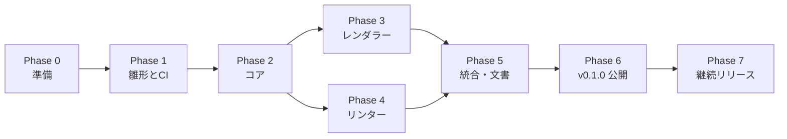

# Breadkit 作業手順書

| 項目 | 内容 |
|---|---|
| 文書種別 | 作業手順書 |
| 対象 | `breadkit` / `breadkit-render` / `breadkit-lint` の実装と RubyGems への公開 |
| 前提文書 | [DESIGN.md](./DESIGN.md)（設計書） |
| 版 | 0.1（初版ドラフト） |

---

## 0. この手順書の使い方

- 設計書の内容を、実装して RubyGems に公開するまでの順序と具体的な作業に落とし込んだものです。
- 各ステップは **作業 / 成果物 / 完了条件** で構成します。完了条件を満たしてから次へ進みます。
- コマンド例の `YOUR_NAME` は GitHub のユーザー名（または組織名）に置き換えてください。
- zsh では `rake bump[0.2.0]` のような角括弧付き引数をクォートする必要があります（`rake "bump[0.2.0]"`）。

## 1. 全体の流れとマイルストーン



Phase 2（コア）の完了後は、Phase 3（レンダラー）と Phase 4（リンター）を並行して進められます。1人で進める場合は、描画結果を目で見ながらコアの不具合に気づけるため Phase 3 を先に進めるのがおすすめです。

| マイルストーン | 到達点 | 含むフェーズ |
|---|---|---|
| M1 | 3 gem の雛形がそろい、CI が通る | Phase 0〜1 |
| M2 | `breadkit nets` で例題のネット一覧が正しく出る | Phase 2 |
| M3 | 例題が SVG / PNG で描画できる | Phase 3 |
| M4 | MVP のルールで例題と誤り例を正しく判定できる | Phase 4 |
| M5 | v0.1.0 を RubyGems に公開 | Phase 5〜6 |
| M6 | Trusted Publishing による自動リリースで v0.2.0 を公開 | Phase 7 |

v0.1.0（MVP）の機能範囲は設計書 [12. ロードマップ](./DESIGN.md#12-ロードマップ) に従います。範囲外の機能は Issue に積んでおき、MVP 公開を優先してください。

---

## 2. Phase 0：準備

### 0-1. 開発環境を用意する

**作業**

```sh
# macOS
brew install mise librsvg          # rsvg-convert（PNG 出力に使用）
brew install vips imagemagick      # 任意：JPEG 出力とバックエンド切替の確認用

# Ubuntu / Debian
sudo apt-get update
sudo apt-get install -y librsvg2-bin fonts-noto-cjk
sudo apt-get install -y libvips-dev imagemagick   # 任意

# Ruby（開発は最新安定版、CI で下限の 3.3 も検証する）
mise use --global ruby@4.0
gem install bundler
```

**完了条件**

- `ruby -v` が 3.3 以上
- `rsvg-convert --version` が表示される
- （任意）`vips -l | grep svgload` で SVG 読み込みが有効な libvips であることを確認

### 0-2. gem 名とコマンド名の空きを確認する

**作業**

```sh
for n in breadkit breadkit-render breadkit-lint; do
  printf "%-16s " "$n"
  curl -s -o /dev/null -w "%{http_code}\n" "https://rubygems.org/api/v1/gems/$n.json"
done
# 404 なら未使用、200 なら使用済み

command -v bkrender bklint breadkit   # 手元で既存コマンドと衝突しないか
```

**注意**

- RubyGems.org は既存 gem と紛らわしい名前（タイポスクワッティング対策）の公開を拒否することがあります。拒否された場合は名前を変更し、設計書・名前空間・コマンド名を一括で置換します。
- 名前を変える可能性があるうちは、名前空間（`Breadkit`）を書き散らさず定数にまとめておくと置換が楽です。

**完了条件**：3つの gem 名がすべて 404 であり、GitHub の各リポジトリ名も確保できることを確認した。

### 0-3. RubyGems.org と GitHub の準備

**作業**

1. RubyGems.org でアカウントを作成し、MFA（多要素認証）を「UI と API」の両方に対して有効化する。
2. 手元で gem signin を実行し、初回公開に使う API キーを取得する。
3. GitHub 組織 breadkit に、公開リポジトリ breadkit、breadkit-render、breadkit-lint をそれぞれ作成する（README なし）。
4. 各リポジトリで main を既定ブランチにし、CI を有効にする。オーナーは main に直接 push できる。

**完了条件**：3つの公開リポジトリがあり、各 main に個別の履歴を持たせられる。

### 0-4. 事前に決めておくこと

| 項目 | 推奨 | 決定 |
|---|---|---|
| ライセンス | MIT | ☐ |
| 対応 Ruby | 3.3 以上 | ☐ |
| テスト | RSpec | ☐ |
| Linter | RuboCop（または Standard） | ☐ |
| メッセージの既定言語 | en（`--locale ja` / `LANG` で日本語） | ☐ |
| 行動規範（CoC） | Contributor Covenant | ☐ |

---

## 3. Phase 1：リポジトリ雛形と CI

### 1-1. 3つの gem を別々のリポジトリで管理する

**作業**

GitHub に breadkit、breadkit-render、breadkit-lint のリポジトリを用意し、各ディレクトリをそれぞれのリポジトリのルートにする。各ディレクトリは bundle gem で個別に生成し、個別の .git と main を持たせる。モノレポ化や --no-git は使わない。

開発時は3つを同じ親ディレクトリに clone する。

```text
projects/
├── breadkit/
├── breadkit-render/
└── breadkit-lint/
```

レンダラーとリンターの開発用 Gemfile は隣にある breadkit を path 依存として参照する。実行時の依存は gemspec に通常の gem バージョン範囲として宣言する。

**完了条件**：各ディレクトリが対応する GitHub リポジトリの main を追跡し、それぞれ単独で gem build できる。

### 1-2. gemspec と Gemfile を整える

各 gemspec の homepage、source_code_uri、changelog_uri、bug_tracker_uri、documentation_uri は、その gem の GitHub リポジトリを指す。breadkit-render と breadkit-lint は breadkit を実行時依存に含め、対応できるコアの範囲をバージョン制約で表す。

レンダラーとリンターの Gemfile には開発時だけ次を指定する。

```ruby
gem "breadkit", path: "../breadkit"
```

この前提で3つを同じ親ディレクトリに clone する。GitHub Actions もコアを breadkit、対象 gem を breadkit-render または breadkit-lint として兄弟ディレクトリに checkout してからテストする。

gemspec の files は git ls-files を使うため、配布するデータ、ロケール、ルール文書は各リポジトリで追跡対象にする。spec、coverage、pkg など開発生成物は gem に含めない。

**完了条件**：各リポジトリで gem build が成功し、gem specification で必要なファイルと依存範囲を確認できる。

### 1-3. テストとビルド

ルート横断 Rakefile は作らない。各リポジトリで個別に Bundler を実行する。

```sh
cd breadkit
bundle install
bundle exec rake
gem build breadkit.gemspec

cd ../breadkit-render
bundle install
bundle exec rake
gem build breadkit-render.gemspec

cd ../breadkit-lint
bundle install
bundle exec rake
gem build breadkit-lint.gemspec
```

breadkit-render と breadkit-lint のローカルテストは隣の breadkit checkout を使う。クリーンな利用環境では gemspec のバージョン制約に従い RubyGems から core を解決する。

**完了条件**：3リポジトリそれぞれで RSpec、RuboCop、gem build が成功する。

### 1-4. リポジトリごとに CI を設定する

各リポジトリの ci.yml は、その gem の RSpec・RuboCop・gem build を実行する。Ruby 3.3、3.4、4.0 を検証する。breadkit-render ではラスタ変換が必要なジョブに librsvg、libvips、日本語フォントを入れる。

レンダラーとリンターの CI は breadkit を兄弟ディレクトリに checkout し、共通例題も検査する。リンターは有効例が無警告であることと、examples/bad の期待ルールが検出されることを確認する。レンダラーは有効例を画像に変換する。

**完了条件**：各リポジトリの main と Pull Request で、そのリポジトリの CI が成功する。 → **M1 達成**

## 4. Phase 2：コア（breadkit）

コアは下から順に積み上げます。各ステップで先にテスト（期待値）を書き、それを満たす実装を行う進め方を推奨します。

### 2-1. 値パーサと穴 ID

**作業**

- `Breadkit::Value.parse("4.7k")` → `4700.0`。`"4k7"`、`"1M"`、`"100n"`、`"10uF"`、`"4.7kΩ"` に対応。`Value#to_s` は `"4.7kΩ"` のような表示用文字列を返す。
- `Breadkit::HoleId.parse("A10")` → `{ kind: :terminal, row: "a", col: 10 }`、`"T+5"` → `{ kind: :rail, rail: "T+", index: 5 }`、`"B-"` → `{ kind: :rail, rail: "B-", index: nil }`、`"U1.3"` → `{ kind: :pin, ref: "U1", pin: "3" }`。

**完了条件**：上記と不正入力（`"k"`, `"a"`, `"T*3"`）の単体テストが通る。

### 2-2. ボード定義とボード生成

**作業**

- `data/boards/full.yml`、`half.yml`、`mini.yml` を作成（設計書 [4.2](./DESIGN.md#42-ボード定義)）。
- `BoardDef.load(id, extra_paths: [])` と `Board.new(board_def, split_rails:)` を実装。`Hole` と `Strip` を生成し、レール穴の x 位置を計算する。

**完了条件**

- 穴の総数が full=830、half=400、mini=170。
- ハーフボードで `B+8` の x 位置が列10、`B-14` が列17。
- `split_rails: true` のフルボードで `T+25` と `T+26` が別ストリップ。

### 2-3. パーツ定義とライブラリ

**作業**

- `PartDef`（YAML の検証を含む）と `PartLibrary`（ID・別名で検索、`use_parts` での追加読み込み）を実装。
- MVP 用の定義を作成：`resistor`、`capacitor`、`electrolytic`、`diode`、`led`、`tact_switch_6mm`、`ne555`、汎用 `dip`（ピン数指定）、`pin_header`。

**完了条件**：全定義が読み込み時の検証を通り、`breadkit parts` 相当のテストで一覧できる。定義の誤り（存在しないピン番号を `internal` に書く等）は分かりやすいエラーになる。

### 2-4. DSL ビルダー

**作業**

- `Breadkit::DSL.load_file(path)` → `Document`。`instance_eval(source, path, 1)` で評価する。
- 各 DSL メソッドで `caller_locations` から DSL ファイル上の行を取り、`SourceLocation` として記録する。
- 未知メソッドは `method_missing` ＋ `DidYouMean::SpellChecker` で候補付きの `Breadkit::DSLError` にする。
- 部品ショートハンド（`resistor` など）はすべて `part` に展開する。

**完了条件**：設計書 [3.2](./DESIGN.md#32-記述例) の例を読み込むと、宣言と行番号が期待どおり `Document` に入る。ループ内の宣言も正しい行を指す。`registor` と書くと `resistor` が提案される。

### 2-5. Resolver

**作業**：設計書 [4.4](./DESIGN.md#44-配置解決resolver) の6段階を実装し、各 Diagnostic を発生させる。

**完了条件**

- NE555 を `at: "e20"` に置くと設計書の表どおりのピン割付になる。`at: "f23"` では逆向きになる。`at: "c20"` では `invalid_placement`。
- `wire "a10", "B+"` がハーフボードで `B+8` に解決される。宣言順を入れ替えても自動選択の結果が変わらない。
- 各 Diagnostic コード（8種）の発生テストがある。

### 2-6. 接続解析

**作業**：Union-Find、ネットの構築、ネット名の決定規則（設計書 [4.5](./DESIGN.md#45-接続解析connectivity)）を実装。

**完了条件**：例題 `01_led_button` のネットが設計書 [3.6](./DESIGN.md#36-ir-json) の `analysis.nets` と一致する（`VCC`、`N1`、`N2`、`GND`）。

### 2-7. 電位解析と短絡経路

**作業**：`PotentialSolver`（BFS による電位割当と矛盾検出）と、2端子間の最短経路探索を実装。

**完了条件**

- 単一電源、同電圧の2電源（矛盾なし）、異電圧の2電源が同一ネット（矛盾）、電源の +/- が同一ネット（矛盾）、GND を共有しない2電源（成分が2つ）の各ケースのテストが通る。
- 短絡時に経路（穴・ワイヤ列）が得られる。

### 2-8. スイッチ状態

**作業**：`State` と `Circuit#states(mode)`（`none` / `single` / `all`）、状態ごとのメモ化を実装。

**完了条件**：例題で SW1 押下状態のとき `VCC` と `N1` が同一ネットになる。

### 2-9. IR の入出力

**作業**：`IR::Writer`、`IR::Reader`、`schema/ir-v1.json` を実装。`Breadkit.load` が拡張子で DSL / IR を判別する。

**完了条件**：`examples/*.bk.rb` すべてで「DSL → IR → 読み込み → IR」が一致する。出力 IR が JSON Schema の検証を通る。

### 2-10. コア CLI と公開 API

**作業**：`breadkit ir` / `nets` / `parts` を `OptionParser` で実装。YARD コメントを公開 API に付ける。

**完了条件**：`bundle exec exe/breadkit nets examples/01_led_button.bk.rb` でネット一覧が表示される。 → **M2 達成**

---

## 5. Phase 3：レンダラー（breadkit-render）

### 3-1. XML ビルダーと座標変換

**作業**：属性・テキストのエスケープを含む最小の XML ビルダーと、ピッチ単位 → SVG 単位の変換（小数第2位丸め）、`viewBox` / `--crop` の計算を実装。

**完了条件**：特殊文字（`<`, `&`, `"`）を含むタイトルが正しくエスケープされ、REXML で整形式として読める。

### 3-2. スナップショットテストの仕組み

**作業**：描画を実装する前に、ゴールデンファイル比較の仕組みを作ります。

```ruby
# spec/support/snapshot.rb
def expect_svg_snapshot(name, svg)
  path = File.join(__dir__, "..", "snapshots", "#{name}.svg")
  if ENV["UPDATE_SNAPSHOTS"] || !File.exist?(path)
    File.write(path, svg)
  else
    expect(svg).to eq(File.read(path)), "snapshot mismatch: #{name}（意図した変更なら UPDATE_SNAPSHOTS=1 で更新）"
  end
end
```

**運用ルール**：スナップショットを更新する PR では、更新前後の画像を PR 本文に貼って目視レビューする。

### 3-3. ボード・穴・ラベルの描画

**作業**：`board` / `holes` / `labels` レイヤを実装し、3種類のボードを描く。

**完了条件**：空のボード（部品なし）を full / half / mini で描画したスナップショットが、実物の写真と比べて穴の配置・レールの切れ目・行記号の向き（a が下）が一致している。

### 3-4. ワイヤの描画

**作業**：直線・弧のワイヤ、端子マーカー、配色規則（設計書 [5.5](./DESIGN.md#55-ワイヤの描画)）を実装。

### 3-5. 部品の描画

**作業**：次の順に `PartRenderer` を実装します。汎用描画を最初に作ることで、以降は常に「何かが描ける」状態を保てます。

1. `GenericRenderer`（矩形＋ピン名）
2. `resistor`（カラーバンド算出を含む。220 → 赤赤茶金、330 → 橙橙茶金、10k → 茶黒橙金 をテスト）
3. `led_5mm`
4. `dip`
5. `tact_switch`
6. `capacitor` / `electrolytic` / `diode`

**完了条件**：`examples/01_led_button.bk.rb` と `02_555_blinker.bk.rb` のスナップショットが確定し、目視で部品の向き（LED のカソード側、IC の切り欠き）が正しい。

### 3-6. ラスタ変換

**作業**

1. `Rasterizer::Base` と検出ロジック（`auto` の選択順）
2. `RsvgConvert`（`Open3.capture3("rsvg-convert", "--format=png", "--zoom=#{scale}", ..., stdin_data: svg, binmode: true)`）
3. `Vips`（`require "vips"` を遅延実行し、`LoadError` なら利用不可とする）
4. `ImageMagick`（`magick` → `convert` の順で探す）
5. バックエンド不在時のエラーメッセージ（OS 別のインストール例を含む）

**完了条件**

- PNG が rsvg / vips / magick の各バックエンドで出力できる（利用可能なものだけテスト、他は skip）。
- JPEG が vips / magick で出力でき、背景が白で平坦化されている。
- バックエンドがない環境で終了コード 2 と案内メッセージが出る（`PATH` を空にしてテスト）。

### 3-7. CLI

**作業**：設計書 [5.1](./DESIGN.md#51-cli) のオプションを `OptionParser` で実装。`-o` の拡張子から形式を判定し、`-f` と矛盾する場合はエラーにする。

**完了条件**

```sh
bundle exec exe/bkrender examples/01_led_button.bk.rb -o /tmp/led.svg
bundle exec exe/bkrender examples/01_led_button.bk.rb -o /tmp/led.png --scale 3
bundle exec exe/bkrender examples/01_led_button.bk.rb | head -c 100   # 標準出力に SVG
```

がすべて成功し、終了コードが設計どおり。 → **M3 達成**

---

## 6. Phase 4：リンター（breadkit-lint）

### 4-1. ルール基盤

**作業**：`Offense`、`Rule`（`rule` マクロと `Registry` への自動登録）、`Context` を実装（設計書 [6.3](./DESIGN.md#63-ルールエンジン)）。

### 4-2. 設定の読み込み

**作業**：`config/default.yml` の読み込み、`.bklint.yml` とのマージ、`inherit_from`、`require`、`Exclude`、`--only` / `--except` を実装。

**完了条件**

- 登録済みの全ルールが `default.yml` に載っていることを確認するテストがある（載っていなければ失敗）。
- 存在しないルール ID を設定に書くと、候補付きの警告が出る。

### 4-3. エンジン

**作業**：Diagnostic → Layout オフェンスの変換、解決不能な Layout エラー時の電気的検査スキップ、状態ごとの実行と重複の集約、`lint_disable` による抑制、並べ替えを実装。

### 4-4. フォーマッタと CLI

**作業**：`text` と `json` フォーマッタ、`bklint` CLI（設計書 [6.1](./DESIGN.md#61-cli)）、`--list-rules`、`--explain`。

**完了条件**：オフェンスの有無と `--fail-level` の組み合わせで終了コード 0 / 1 / 2 が正しく返る。

### 4-5. ルールの実装

**作業**：ルールは1つずつ、次のテンプレート手順で追加します。

1. `spec/fixtures/rules/<カテゴリ>/<名前>/offense.bk.rb` と `no_offense.bk.rb` を書く（検出すべき例と、検出してはいけない紛らわしい例）
2. `docs/rules/<カテゴリ>/<名前>.md` に説明・誤り例・修正例を書く（`--explain` の元になる）
3. ルールクラスを実装する
4. `config/default.yml` にエントリを追加する（マイナーリリース後に追加するルールは `Enabled: pending`）
5. メッセージを `locales/en.yml` と `locales/ja.yml` に追加する
6. 共有例でテストし、`examples/*.bk.rb` で誤検出がないことを確認する

**MVP（v0.1.0）での実装順**

| 順 | ルール | ポイント |
|---|---|---|
| 1 | `Layout/*`（Diagnostic 由来の7種） | エンジンの変換処理だけでまとめて実現できる |
| 2 | `Layout/PinsInSameStrip` | 抵抗を同じ列に縦挿しした例、DIP を片側に寄せた例 |
| 3 | `Electrical/ShortCircuit` | 短絡経路がメッセージに含まれることを確認 |
| 4 | `Electrical/FloatingPin` | `unused:` とタクトスイッチの内部接続で誤検出しないこと |
| 5 | `Electrical/DanglingWire` | レール上のワイヤ端も対象 |
| 6 | `Electrical/ShortedComponent` | `PinsInSameStrip` と二重報告しないこと |
| 7 | `Electrical/NetLabelConflict` | |
| 8 | `Intent/ConnectionMismatch`、`Intent/UnknownNet` | `connected` / `isolated`（`strict` は v0.3） |

**完了条件**：`examples/*.bk.rb` がすべて無警告、`examples/bad/*.bk.rb` がそれぞれ期待したルールで検出される。 → **M4 達成**

---

## 7. Phase 5：統合とドキュメント

### 5-1. 例題をそろえる

| ファイル | 内容 | 期待 |
|---|---|---|
| `examples/01_led_button.bk.rb` | 押しボタンで LED 点灯（設計書 3.2） | 無警告 |
| `examples/02_555_blinker.bk.rb` | NE555 の非安定マルチバイブレータで LED 点滅 | 無警告 |
| `examples/03_arduino_blink.bk.rb` | Arduino UNO に LED を接続 | 無警告 |
| `examples/04_led_bar.bk.rb` | ループで LED 4 連 | 無警告 |
| `examples/bad/short_circuit.bk.rb` | VCC と GND をワイヤで直結 | `Electrical/ShortCircuit` |
| `examples/bad/resistor_same_column.bk.rb` | 抵抗を同じ列に縦挿し | `Layout/PinsInSameStrip` |
| `examples/bad/floating_led.bk.rb` | LED のカソードがどこにもつながらない | `Electrical/FloatingPin` |
| `examples/bad/ic_not_straddling.bk.rb` | IC の1番ピンを c 行に指定 | `Layout/InvalidPlacement` |

`examples/bad/` の各ファイル冒頭に `# expect: Electrical/ShortCircuit` のように期待ルールを書き、結合テストで照合します。

### 5-2. 実機での検証

**作業**：例題 01 と 02 を実際にブレッドボードで組み、次を確認します。

- 描画結果の見た目（部品の位置・向き・ワイヤ）が実物と対応している。
- 意図どおりに動作する（ボタンで LED が点く、555 で LED が点滅する）。
- 実物で1箇所わざと誤配線し、同じ誤りを DSL に反映すると bklint が検出する。
- タクトスイッチの内部導通の向きが `tact_switch_6mm.yml` と一致している（テスターで確認）。

### 5-3. ドキュメント

| 文書 | 内容 |
|---|---|
| 各 gem の `README.md` | インストール、使い方、オプション一覧。レンダラーはラスタ変換バックエンドの導入方法と日本語フォントの注意 |
| `docs/dsl.md` | DSL リファレンス（設計書 3 章を利用者向けに書き直したもの） |
| `breadkit-lint/docs/rules/**/*.md` | ルールごとの説明（Phase 4 で作成） |
| セキュリティの注意 | DSL は Ruby コードとして実行されるため、信頼できないファイルを評価しないこと。代替として IR JSON 入力が使えること |

### 5-4. gem 間の結合を確認する

breadkit の examples を使って、breadkit-lint が正常例を警告なしで検査し、breadkit-render が SVG / PNG を生成できることを確認する。例題は各 gem の CI から core リポジトリを checkout して実行する。

## 8. Phase 6：初回リリース（v0.1.0）

初回はコアを先に RubyGems.org へ公開し、その後、利用可能になったコアのバージョン範囲に対応するレンダラーとリンターを個別に公開する。gem のバージョン番号とリリース日は揃える必要がない。

### 6-1. gem ごとのリリース前チェック

各リポジトリで次を確認する。

- [ ] そのリポジトリの main CI が緑
- [ ] gemspec のバージョンと lib 内の version.rb が一致
- [ ] README のコマンド例が動く
- [ ] CHANGELOG.md にその gem のリリース内容がある
- [ ] gemspec の summary / description / homepage / metadata に TODO 等が残っていない
- [ ] gem に含めるファイルと実行ファイルを確認済み

レンダラーとリンターでは、gemspec の breadkit 依存範囲がテストしたコア API / IR と合っていることも確認する。

### 6-2. 各 gem を個別にビルドする

各リポジトリのルートで実行する。

```sh
bundle exec rake
gem build breadkit.gemspec
gem specification breadkit-*.gem files
```

レンダラーでは breadkit-render.gemspec と breadkit-render-*.gem、リンターでは breadkit-lint.gemspec と breadkit-lint-*.gem を指定する。spec、coverage、開発用 Gemfile が配布物に入っていないことを確認する。

### 6-3. クリーンな環境で確認する

Ruby 3.3 の新しい環境で core gem をインストールしてから、レンダラーとリンターをそれぞれインストールする。各 CLI で core の DSL 例題を処理し、SVG と PNG を生成する。CI と同じ例題検査も行う。

### 6-4. RubyGems.org に公開する

MFA を使い、まず breadkit を公開する。インストールを確認した後、breadkit-render と breadkit-lint を必要な順に個別公開する。依存 gem が未公開なら先に公開する。公開済みバージョンは上書きできないため、公開直前にファイルとバージョンを再確認する。

### 6-5. GitHub Releases と公開後の確認

各リポジトリで、その gem のバージョンに対応する vX.Y.Z タグを push し、GitHub Release を作る。3つの gem のタグは別々に作成できる。

- [ ] RubyGems.org の各 gem ページから正しい GitHub リポジトリへ移動できる
- [ ] クリーン環境で各 gem をインストールできる
- [ ] breadkit-render と breadkit-lint の依存解決で互換性のある breadkit が入る
- [ ] GitHub Release の内容が各リポジトリの CHANGELOG と一致する

→ **M5 達成**

## 9. Phase 7：個別リリースと運用

### 7-1. Trusted Publishing を設定する

RubyGems.org で各 gem の Trusted Publisher を設定する。Repository owner / name は gem ごとに breadkit/breadkit、breadkit/breadkit-render、breadkit/breadkit-lint とする。Workflow filename は release.yml、Environment は release。

GitHub の各リポジトリに release 環境を設定する。承認を必須にする場合は、各リポジトリの Environment に Required reviewers を指定する。RUBYGEMS_TRUSTED_PUBLISHING=enabled は、その gem の Trusted Publisher と環境設定が完了してからリポジトリ変数に追加する。

### 7-2. リポジトリ単位のリリース

各 release.yml は自リポジトリの version.rb と vX.Y.Z タグを照合し、自分の gem だけをビルドして RubyGems.org に公開する。GitHub Release もそのリポジトリで作る。コアを変更していないレンダラーやリンターに新しいタグを付ける必要はない。

### 7-3. 次回以降のリリース手順

リリースする gem のリポジトリで作業する。

```sh
git switch main
git pull
# version.rb と CHANGELOG.md をこの gem だけ更新
bundle exec rake
gem build <gem-name>.gemspec
git add .
git commit -m "Release vX.Y.Z"
git tag vX.Y.Z
git push origin main vX.Y.Z
```

breadkit の API または IR を変更した場合は、レンダラーとリンターの互換性を確認する。追随が必要なリポジトリだけで依存範囲・テスト・バージョンを更新してリリースする。

### 7-4. 運用

| 項目 | 内容 |
|---|---|
| 依存の更新 | Dependabot を各リポジトリで有効にする |
| Issue テンプレート | gem ごとに不具合報告と再現用 DSL / IR を受け取る |
| セキュリティ | 各リポジトリに SECURITY.md と報告窓口を記載する |
| 対応 Ruby | 公式サポートが終了したバージョンは次のマイナーリリースで対応を外す |
| 問題のあるリリース | 影響する gem を特定し、必要な修正版のみを公開する |
| 新しいルール | リンターのリポジトリで追加し、ルール ID と既定有効化時期を CHANGELOG に記載する |

---

## 付録 A. フェーズ完了チェックリスト

- [ ] **M1** 3つの独立したリポジトリに雛形があり、それぞれの CI が緑
- [ ] **M2** breadkit nets で例題のネットが設計どおり
- [ ] **M3** breadkit-render で例題を SVG / PNG / JPEG に描画でき、スナップショットが確定
- [ ] **M4** breadkit-lint で正常例と誤り例を期待どおり検査
- [ ] **M5** 3 gem を個別に RubyGems.org へ公開し、クリーン環境で確認
- [ ] **M6** Trusted Publishing で各 gem を個別にリリース

## 付録 B. コマンド早見表

| 目的 | コマンド |
|---|---|
| コアのテスト | cd breadkit && bundle exec rake |
| レンダラーのテスト | cd breadkit-render && bundle exec rake |
| リンターのテスト | cd breadkit-lint && bundle exec rake |
| スナップショット更新 | cd breadkit-render && UPDATE_SNAPSHOTS=1 bundle exec rspec |
| ネット一覧 | cd breadkit && bundle exec exe/breadkit nets examples/01_led_button.bk.rb |
| 描画 | bkrender FILE -o out.png --scale 3 --legend |
| リント | bklint FILE、bklint FILE -f json > lint.json |
| リント結果を重ねて描画 | bkrender FILE --annotations lint.json -o review.png |
| ビルド | 各 gem リポジトリで gem build <gem-name>.gemspec |
| パッケージ確認 | gem specification <gem-file>.gem files |

## 付録 C. トラブルシューティング

| 症状 | 原因と対処 |
|---|---|
| PNG 出力で「バックエンドが見つからない」 | rsvg-convert が未導入。brew install librsvg / apt-get install librsvg2-bin |
| vips で SVG が読めない | libvips が librsvg なしでビルドされている。vips -l で svgload を確認 |
| PNG で日本語ラベルが豆腐（□）になる | ラスタ変換環境に日本語フォントがない。fonts-noto-cjk などを導入 |
| gem build にファイルが含まれない | git ls-files の対象か確認し、各リポジトリでコミットされていることを確認 |
