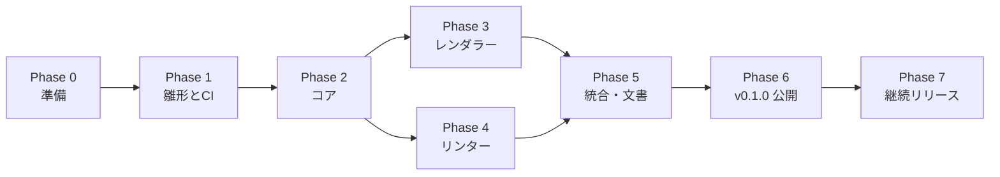

# Breadkit 作業手順書

| 項目 | 内容 |
|---|---|
| 文書種別 | 作業手順書 |
| 対象 | `breadkit` / `breadkit-render` / `breadkit-lint` の実装と RubyGems への公開 |
| 前提文書 | [DESIGN.md](./DESIGN.md)（設計書） |
| 版 | 0.1（初版ドラフト） |

---

## 0. この手順書の使い方

- 設計書の内容を、実装して RubyGems に公開するまでの順序と具体的な作業に落とし込んだものです。
- 各ステップは **作業 / 成果物 / 完了条件** で構成します。完了条件を満たしてから次へ進みます。
- コマンド例の `YOUR_NAME` は GitHub のユーザー名（または組織名）に置き換えてください。
- zsh では `rake bump[0.2.0]` のような角括弧付き引数をクォートする必要があります（`rake "bump[0.2.0]"`）。

## 1. 全体の流れとマイルストーン



Phase 2（コア）の完了後は、Phase 3（レンダラー）と Phase 4（リンター）を並行して進められます。1人で進める場合は、描画結果を目で見ながらコアの不具合に気づけるため Phase 3 を先に進めるのがおすすめです。

| マイルストーン | 到達点 | 含むフェーズ |
|---|---|---|
| M1 | 3 gem の雛形がそろい、CI が通る | Phase 0〜1 |
| M2 | `breadkit nets` で例題のネット一覧が正しく出る | Phase 2 |
| M3 | 例題が SVG / PNG で描画できる | Phase 3 |
| M4 | MVP のルールで例題と誤り例を正しく判定できる | Phase 4 |
| M5 | v0.1.0 を RubyGems に公開 | Phase 5〜6 |
| M6 | Trusted Publishing による自動リリースで v0.2.0 を公開 | Phase 7 |

v0.1.0（MVP）の機能範囲は設計書 [12. ロードマップ](./DESIGN.md#12-ロードマップ) に従います。範囲外の機能は Issue に積んでおき、MVP 公開を優先してください。

---

## 2. Phase 0：準備

### 0-1. 開発環境を用意する

**作業**

```sh
# macOS
brew install mise librsvg          # rsvg-convert（PNG 出力に使用）
brew install vips imagemagick      # 任意：JPEG 出力とバックエンド切替の確認用

# Ubuntu / Debian
sudo apt-get update
sudo apt-get install -y librsvg2-bin fonts-noto-cjk
sudo apt-get install -y libvips-dev imagemagick   # 任意

# Ruby（開発は最新安定版、CI で下限の 3.3 も検証する）
mise use --global ruby@4.0
gem install bundler
```

**完了条件**

- `ruby -v` が 3.3 以上
- `rsvg-convert --version` が表示される
- （任意）`vips -l | grep svgload` で SVG 読み込みが有効な libvips であることを確認

### 0-2. gem 名とコマンド名の空きを確認する

**作業**

```sh
for n in breadkit breadkit-render breadkit-lint; do
  printf "%-16s " "$n"
  curl -s -o /dev/null -w "%{http_code}\n" "https://rubygems.org/api/v1/gems/$n.json"
done
# 404 なら未使用、200 なら使用済み

command -v bkrender bklint breadkit   # 手元で既存コマンドと衝突しないか
```

**注意**

- RubyGems.org は既存 gem と紛らわしい名前（タイポスクワッティング対策）の公開を拒否することがあります。拒否された場合は名前を変更し、設計書・名前空間・コマンド名を一括で置換します。
- 名前を変える可能性があるうちは、名前空間（`Breadkit`）を書き散らさず定数にまとめておくと置換が楽です。

**完了条件**：3つの gem 名がすべて 404（未使用）であることを確認し、名前を確定した。

### 0-3. RubyGems.org と GitHub の準備

**作業**

1. RubyGems.org でアカウントを作成し、MFA（多要素認証）を「UI と API」の両方に対して有効化する。
2. 手元で `gem signin` を実行し、API キーを取得する（初回公開は手動で行うため）。
3. GitHub にリポジトリ `YOUR_NAME/breadkit` を作成する（公開、README なし）。
4. `main` ブランチの保護を設定する（PR 必須、CI 成功必須）。

**完了条件**：`gem signin` が成功し、GitHub に空のリポジトリがある。

### 0-4. 事前に決めておくこと

| 項目 | 推奨 | 決定 |
|---|---|---|
| ライセンス | MIT | ☐ |
| 対応 Ruby | 3.3 以上 | ☐ |
| テスト | RSpec | ☐ |
| Linter | RuboCop（または Standard） | ☐ |
| メッセージの既定言語 | en（`--locale ja` / `LANG` で日本語） | ☐ |
| 行動規範（CoC） | Contributor Covenant | ☐ |

---

## 3. Phase 1：リポジトリ雛形と CI

### 1-1. 3 gem の雛形を作る

**作業**

```sh
git clone git@github.com:YOUR_NAME/breadkit.git
cd breadkit

# モノレポ内に 3 つの gem を生成（入れ子の git リポジトリを作らないよう --no-git）
for g in breadkit breadkit-render breadkit-lint; do
  bundle gem "$g" --no-git --no-exe --no-ci --test=rspec --linter=rubocop --mit --changelog --no-coc
done

# LICENSE.txt は各 gem のパッケージに含める必要があるため各ディレクトリに残し、ルートにも置く
cp breadkit/LICENSE.txt ./LICENSE.txt
# CHANGELOG はルートの1ファイルに集約する（gem ごとの節に分けて書く）
rm breadkit/CHANGELOG.md breadkit-render/CHANGELOG.md breadkit-lint/CHANGELOG.md
touch CHANGELOG.md
echo "0.1.0" > VERSION
```

`bundle gem breadkit-render` は `Breadkit::Render` 名前空間（`lib/breadkit/render.rb`、`lib/breadkit/render/version.rb`）を生成します。実行ファイルは名前が gem 名と異なるため手で作ります。

```sh
mkdir -p breadkit/exe breadkit-render/exe breadkit-lint/exe
touch breadkit/exe/breadkit breadkit-render/exe/bkrender breadkit-lint/exe/bklint
chmod +x breadkit/exe/breadkit breadkit-render/exe/bkrender breadkit-lint/exe/bklint
```

```ruby
#!/usr/bin/env ruby
# breadkit-render/exe/bkrender
require "breadkit/render"
exit Breadkit::Render::CLI.new.run(ARGV)
```

**完了条件**：設計書 [2.4](./DESIGN.md#24-リポジトリ構成モノレポ) のディレクトリ構成になっている。

### 1-2. gemspec を整える

**作業**：3つの gemspec を次の方針で編集します（例は `breadkit-render`）。

```ruby
# breadkit-render/breadkit-render.gemspec
require_relative "lib/breadkit/render/version"

Gem::Specification.new do |spec|
  spec.name        = "breadkit-render"
  spec.version     = Breadkit::Render::VERSION
  spec.authors     = ["Your Name"]
  spec.email       = ["you@example.com"]
  spec.summary     = "Render breadboard wiring written in the Breadkit DSL to SVG / PNG / JPEG."
  spec.description = "bkrender turns a Breadkit DSL file into a breadboard wiring diagram."
  spec.homepage    = "https://github.com/YOUR_NAME/breadkit"
  spec.license     = "MIT"
  spec.required_ruby_version = ">= 3.3"

  spec.metadata = {
    "homepage_uri"          => spec.homepage,
    "source_code_uri"       => "#{spec.homepage}/tree/main/breadkit-render",
    "changelog_uri"         => "#{spec.homepage}/blob/main/CHANGELOG.md",
    "bug_tracker_uri"       => "#{spec.homepage}/issues",
    "documentation_uri"     => "#{spec.homepage}/tree/main/docs",
    "rubygems_mfa_required" => "true"
  }

  spec.files = Dir.chdir(__dir__) do
    `git ls-files -z`.split("\x0").reject { |f| f.start_with?("spec/", "bin/", ".") }
  end
  spec.bindir        = "exe"
  spec.executables   = ["bkrender"]
  spec.require_paths = ["lib"]

  spec.add_dependency "breadkit", "~> 0.1.0"
end
```

| gem | executables | 追加で files に含まれるべきもの | add_dependency |
|---|---|---|---|
| `breadkit` | `breadkit` | `data/boards/*.yml`、`data/parts/*.yml`、`schema/ir-v1.json`、`locales/*.yml` | なし |
| `breadkit-render` | `bkrender` | `locales/*.yml` | `breadkit ~> 0.1.0` |
| `breadkit-lint` | `bklint` | `config/default.yml`、`locales/*.yml` | `breadkit ~> 0.1.0` |

`git ls-files` はコミット（またはステージ）済みのファイルしか列挙しません。YAML などのデータファイルを追加したら必ずコミットしてください（リリース前に [6-3](#6-3-パッケージの中身を確認する) で確認します）。

**完了条件**：各 gem ディレクトリで `gem build *.gemspec` が警告なしで成功する。

### 1-3. 開発用 Gemfile とルートの Rakefile

**作業**：レンダラーとリンターは、開発中はローカルのコアを参照します。

```ruby
# breadkit-render/Gemfile（breadkit-lint も同様）
source "https://rubygems.org"
gemspec

gem "breadkit", path: "../breadkit"

group :development, :test do
  gem "rake"
  gem "rspec"
  gem "rubocop", require: false
  gem "simplecov", require: false
  gem "ruby-vips", require: false   # breadkit-render のみ。任意バックエンドの検証用
end
```

```ruby
# Gemfile（ルート）
source "https://rubygems.org"
gem "rake"
```

```ruby
# Rakefile（ルート）
GEMS = %w[breadkit breadkit-render breadkit-lint].freeze

def each_gem(task)
  GEMS.each do |g|
    Dir.chdir(g) { Bundler.with_unbundled_env { sh "bundle exec rake #{task}" } }
  end
end

desc "全 gem のテスト"
task(:spec) { each_gem("spec") }
desc "全 gem の静的解析"
task(:rubocop) { each_gem("rubocop") }
desc "全 gem をビルド（各 gem の pkg/ に出力）"
task(:build) { each_gem("build") }
task default: %i[rubocop spec]

desc "全 gem のバージョンと相互依存を更新（例: rake bump[0.2.0]）"
task :bump, [:version] do |_, args|
  version = args.fetch(:version)
  major, minor, = version.split(".")
  constraint = major == "0" ? "~> 0.#{minor}.0" : "~> #{major}.#{minor}"

  File.write("VERSION", "#{version}\n")
  Dir["*/lib/**/version.rb"].each do |f|
    File.write(f, File.read(f).sub(/VERSION = ".*?"/, %(VERSION = "#{version}")))
  end
  %w[breadkit-render breadkit-lint].each do |g|
    path = "#{g}/#{g}.gemspec"
    File.write(path, File.read(path).sub(/add_dependency "breadkit", ".*?"/,
                                         %(add_dependency "breadkit", "#{constraint}")))
  end
  puts "bumped to #{version} (breadkit #{constraint})"
end
```

**完了条件**：ルートで `bundle install && bundle exec rake` が成功する（中身が空のテストで可）。

### 1-4. CI を設定する

**作業**：`.github/workflows/ci.yml` を作成します。

```yaml
name: CI

on:
  push:
    branches: [main]
  pull_request:

jobs:
  test:
    name: ${{ matrix.gem }} / Ruby ${{ matrix.ruby }} / ${{ matrix.os }}
    runs-on: ${{ matrix.os }}
    strategy:
      fail-fast: false
      matrix:
        os: [ubuntu-latest]
        ruby: ["3.3", "3.4", "4.0"]
        gem: [breadkit, breadkit-render, breadkit-lint]
        include:
          - { os: macos-latest, ruby: "4.0", gem: breadkit-render }
    defaults:
      run:
        working-directory: ${{ matrix.gem }}
    steps:
      - uses: actions/checkout@v6
      - name: Install rasterizer (Linux)
        if: matrix.gem == 'breadkit-render' && runner.os == 'Linux'
        run: sudo apt-get update && sudo apt-get install -y librsvg2-bin libvips-dev fonts-noto-cjk
      - name: Install rasterizer (macOS)
        if: matrix.gem == 'breadkit-render' && runner.os == 'macOS'
        run: brew install librsvg vips
      - uses: ruby/setup-ruby@v1
        with:
          ruby-version: ${{ matrix.ruby }}
          bundler-cache: true
          working-directory: ${{ matrix.gem }}
      - run: bundle exec rake

  examples:
    name: examples (lint + render)
    runs-on: ubuntu-latest
    needs: test
    steps:
      - uses: actions/checkout@v6
      - run: sudo apt-get update && sudo apt-get install -y librsvg2-bin fonts-noto-cjk
      - uses: ruby/setup-ruby@v1
        with:
          ruby-version: "4.0"
          bundler-cache: true
          working-directory: breadkit-render
      - name: Build and install gems locally
        run: |
          for g in breadkit breadkit-render breadkit-lint; do
            (cd "$g" && gem build "$g.gemspec" && gem install --local "./$g-$(cat ../VERSION).gem")
          done
      - name: Lint examples (must be clean)
        run: bklint examples/*.bk.rb
      - name: Render examples
        run: |
          mkdir -p out
          for f in examples/*.bk.rb; do
            bkrender "$f" -o "out/$(basename "$f" .bk.rb).png"
          done
      - uses: actions/upload-artifact@v4
        with:
          name: rendered-examples
          path: out/
```

`examples` ジョブは Phase 5 で例題がそろってから有効にします（それまでは `if: false` にしておく）。描画結果は Artifacts からダウンロードして目視確認できます。アクションの版は作業時点の最新メジャーを確認して使ってください。

**完了条件**：PR を作ると全マトリクスが緑になる。 → **M1 達成**

---

## 4. Phase 2：コア（breadkit）

コアは下から順に積み上げます。各ステップで先にテスト（期待値）を書き、それを満たす実装を行う進め方を推奨します。

### 2-1. 値パーサと穴 ID

**作業**

- `Breadkit::Value.parse("4.7k")` → `4700.0`。`"4k7"`、`"1M"`、`"100n"`、`"10uF"`、`"4.7kΩ"` に対応。`Value#to_s` は `"4.7kΩ"` のような表示用文字列を返す。
- `Breadkit::HoleId.parse("A10")` → `{ kind: :terminal, row: "a", col: 10 }`、`"T+5"` → `{ kind: :rail, rail: "T+", index: 5 }`、`"B-"` → `{ kind: :rail, rail: "B-", index: nil }`、`"U1.3"` → `{ kind: :pin, ref: "U1", pin: "3" }`。

**完了条件**：上記と不正入力（`"k"`, `"a"`, `"T*3"`）の単体テストが通る。

### 2-2. ボード定義とボード生成

**作業**

- `data/boards/full.yml`、`half.yml`、`mini.yml` を作成（設計書 [4.2](./DESIGN.md#42-ボード定義)）。
- `BoardDef.load(id, extra_paths: [])` と `Board.new(board_def, split_rails:)` を実装。`Hole` と `Strip` を生成し、レール穴の x 位置を計算する。

**完了条件**

- 穴の総数が full=830、half=400、mini=170。
- ハーフボードで `B+8` の x 位置が列10、`B-14` が列17。
- `split_rails: true` のフルボードで `T+25` と `T+26` が別ストリップ。

### 2-3. パーツ定義とライブラリ

**作業**

- `PartDef`（YAML の検証を含む）と `PartLibrary`（ID・別名で検索、`use_parts` での追加読み込み）を実装。
- MVP 用の定義を作成：`resistor`、`capacitor`、`electrolytic`、`diode`、`led`、`tact_switch_6mm`、`ne555`、汎用 `dip`（ピン数指定）、`pin_header`。

**完了条件**：全定義が読み込み時の検証を通り、`breadkit parts` 相当のテストで一覧できる。定義の誤り（存在しないピン番号を `internal` に書く等）は分かりやすいエラーになる。

### 2-4. DSL ビルダー

**作業**

- `Breadkit::DSL.load_file(path)` → `Document`。`instance_eval(source, path, 1)` で評価する。
- 各 DSL メソッドで `caller_locations` から DSL ファイル上の行を取り、`SourceLocation` として記録する。
- 未知メソッドは `method_missing` ＋ `DidYouMean::SpellChecker` で候補付きの `Breadkit::DSLError` にする。
- 部品ショートハンド（`resistor` など）はすべて `part` に展開する。

**完了条件**：設計書 [3.2](./DESIGN.md#32-記述例) の例を読み込むと、宣言と行番号が期待どおり `Document` に入る。ループ内の宣言も正しい行を指す。`registor` と書くと `resistor` が提案される。

### 2-5. Resolver

**作業**：設計書 [4.4](./DESIGN.md#44-配置解決resolver) の6段階を実装し、各 Diagnostic を発生させる。

**完了条件**

- NE555 を `at: "e20"` に置くと設計書の表どおりのピン割付になる。`at: "f23"` では逆向きになる。`at: "c20"` では `invalid_placement`。
- `wire "a10", "B+"` がハーフボードで `B+8` に解決される。宣言順を入れ替えても自動選択の結果が変わらない。
- 各 Diagnostic コード（8種）の発生テストがある。

### 2-6. 接続解析

**作業**：Union-Find、ネットの構築、ネット名の決定規則（設計書 [4.5](./DESIGN.md#45-接続解析connectivity)）を実装。

**完了条件**：例題 `01_led_button` のネットが設計書 [3.6](./DESIGN.md#36-ir-json) の `analysis.nets` と一致する（`VCC`、`N1`、`N2`、`GND`）。

### 2-7. 電位解析と短絡経路

**作業**：`PotentialSolver`（BFS による電位割当と矛盾検出）と、2端子間の最短経路探索を実装。

**完了条件**

- 単一電源、同電圧の2電源（矛盾なし）、異電圧の2電源が同一ネット（矛盾）、電源の +/- が同一ネット（矛盾）、GND を共有しない2電源（成分が2つ）の各ケースのテストが通る。
- 短絡時に経路（穴・ワイヤ列）が得られる。

### 2-8. スイッチ状態

**作業**：`State` と `Circuit#states(mode)`（`none` / `single` / `all`）、状態ごとのメモ化を実装。

**完了条件**：例題で SW1 押下状態のとき `VCC` と `N1` が同一ネットになる。

### 2-9. IR の入出力

**作業**：`IR::Writer`、`IR::Reader`、`schema/ir-v1.json` を実装。`Breadkit.load` が拡張子で DSL / IR を判別する。

**完了条件**：`examples/*.bk.rb` すべてで「DSL → IR → 読み込み → IR」が一致する。出力 IR が JSON Schema の検証を通る。

### 2-10. コア CLI と公開 API

**作業**：`breadkit ir` / `nets` / `parts` を `OptionParser` で実装。YARD コメントを公開 API に付ける。

**完了条件**：`bundle exec exe/breadkit nets ../examples/01_led_button.bk.rb` でネット一覧が表示される。 → **M2 達成**

---

## 5. Phase 3：レンダラー（breadkit-render）

### 3-1. XML ビルダーと座標変換

**作業**：属性・テキストのエスケープを含む最小の XML ビルダーと、ピッチ単位 → SVG 単位の変換（小数第2位丸め）、`viewBox` / `--crop` の計算を実装。

**完了条件**：特殊文字（`<`, `&`, `"`）を含むタイトルが正しくエスケープされ、REXML で整形式として読める。

### 3-2. スナップショットテストの仕組み

**作業**：描画を実装する前に、ゴールデンファイル比較の仕組みを作ります。

```ruby
# spec/support/snapshot.rb
def expect_svg_snapshot(name, svg)
  path = File.join(__dir__, "..", "snapshots", "#{name}.svg")
  if ENV["UPDATE_SNAPSHOTS"] || !File.exist?(path)
    File.write(path, svg)
  else
    expect(svg).to eq(File.read(path)), "snapshot mismatch: #{name}（意図した変更なら UPDATE_SNAPSHOTS=1 で更新）"
  end
end
```

**運用ルール**：スナップショットを更新する PR では、更新前後の画像を PR 本文に貼って目視レビューする。

### 3-3. ボード・穴・ラベルの描画

**作業**：`board` / `holes` / `labels` レイヤを実装し、3種類のボードを描く。

**完了条件**：空のボード（部品なし）を full / half / mini で描画したスナップショットが、実物の写真と比べて穴の配置・レールの切れ目・行記号の向き（a が下）が一致している。

### 3-4. ワイヤの描画

**作業**：直線・弧のワイヤ、端子マーカー、配色規則（設計書 [5.5](./DESIGN.md#55-ワイヤの描画)）を実装。

### 3-5. 部品の描画

**作業**：次の順に `PartRenderer` を実装します。汎用描画を最初に作ることで、以降は常に「何かが描ける」状態を保てます。

1. `GenericRenderer`（矩形＋ピン名）
2. `resistor`（カラーバンド算出を含む。220 → 赤赤茶金、330 → 橙橙茶金、10k → 茶黒橙金 をテスト）
3. `led_5mm`
4. `dip`
5. `tact_switch`
6. `capacitor` / `electrolytic` / `diode`

**完了条件**：`examples/01_led_button.bk.rb` と `02_555_blinker.bk.rb` のスナップショットが確定し、目視で部品の向き（LED のカソード側、IC の切り欠き）が正しい。

### 3-6. ラスタ変換

**作業**

1. `Rasterizer::Base` と検出ロジック（`auto` の選択順）
2. `RsvgConvert`（`Open3.capture3("rsvg-convert", "--format=png", "--zoom=#{scale}", ..., stdin_data: svg, binmode: true)`）
3. `Vips`（`require "vips"` を遅延実行し、`LoadError` なら利用不可とする）
4. `ImageMagick`（`magick` → `convert` の順で探す）
5. バックエンド不在時のエラーメッセージ（OS 別のインストール例を含む）

**完了条件**

- PNG が rsvg / vips / magick の各バックエンドで出力できる（利用可能なものだけテスト、他は skip）。
- JPEG が vips / magick で出力でき、背景が白で平坦化されている。
- バックエンドがない環境で終了コード 2 と案内メッセージが出る（`PATH` を空にしてテスト）。

### 3-7. CLI

**作業**：設計書 [5.1](./DESIGN.md#51-cli) のオプションを `OptionParser` で実装。`-o` の拡張子から形式を判定し、`-f` と矛盾する場合はエラーにする。

**完了条件**

```sh
bundle exec exe/bkrender ../examples/01_led_button.bk.rb -o /tmp/led.svg
bundle exec exe/bkrender ../examples/01_led_button.bk.rb -o /tmp/led.png --scale 3
bundle exec exe/bkrender ../examples/01_led_button.bk.rb | head -c 100   # 標準出力に SVG
```

がすべて成功し、終了コードが設計どおり。 → **M3 達成**

---

## 6. Phase 4：リンター（breadkit-lint）

### 4-1. ルール基盤

**作業**：`Offense`、`Rule`（`rule` マクロと `Registry` への自動登録）、`Context` を実装（設計書 [6.3](./DESIGN.md#63-ルールエンジン)）。

### 4-2. 設定の読み込み

**作業**：`config/default.yml` の読み込み、`.bklint.yml` とのマージ、`inherit_from`、`require`、`Exclude`、`--only` / `--except` を実装。

**完了条件**

- 登録済みの全ルールが `default.yml` に載っていることを確認するテストがある（載っていなければ失敗）。
- 存在しないルール ID を設定に書くと、候補付きの警告が出る。

### 4-3. エンジン

**作業**：Diagnostic → Layout オフェンスの変換、解決不能な Layout エラー時の電気的検査スキップ、状態ごとの実行と重複の集約、`lint_disable` による抑制、並べ替えを実装。

### 4-4. フォーマッタと CLI

**作業**：`text` と `json` フォーマッタ、`bklint` CLI（設計書 [6.1](./DESIGN.md#61-cli)）、`--list-rules`、`--explain`。

**完了条件**：オフェンスの有無と `--fail-level` の組み合わせで終了コード 0 / 1 / 2 が正しく返る。

### 4-5. ルールの実装

**作業**：ルールは1つずつ、次のテンプレート手順で追加します。

1. `spec/fixtures/rules/<カテゴリ>/<名前>/offense.bk.rb` と `no_offense.bk.rb` を書く（検出すべき例と、検出してはいけない紛らわしい例）
2. `docs/rules/<カテゴリ>/<名前>.md` に説明・誤り例・修正例を書く（`--explain` の元になる）
3. ルールクラスを実装する
4. `config/default.yml` にエントリを追加する（マイナーリリース後に追加するルールは `Enabled: pending`）
5. メッセージを `locales/en.yml` と `locales/ja.yml` に追加する
6. 共有例でテストし、`examples/*.bk.rb` で誤検出がないことを確認する

**MVP（v0.1.0）での実装順**

| 順 | ルール | ポイント |
|---|---|---|
| 1 | `Layout/*`（Diagnostic 由来の7種） | エンジンの変換処理だけでまとめて実現できる |
| 2 | `Layout/PinsInSameStrip` | 抵抗を同じ列に縦挿しした例、DIP を片側に寄せた例 |
| 3 | `Electrical/ShortCircuit` | 短絡経路がメッセージに含まれることを確認 |
| 4 | `Electrical/FloatingPin` | `unused:` とタクトスイッチの内部接続で誤検出しないこと |
| 5 | `Electrical/DanglingWire` | レール上のワイヤ端も対象 |
| 6 | `Electrical/ShortedComponent` | `PinsInSameStrip` と二重報告しないこと |
| 7 | `Electrical/NetLabelConflict` | |
| 8 | `Intent/ConnectionMismatch`、`Intent/UnknownNet` | `connected` / `isolated`（`strict` は v0.3） |

**完了条件**：`examples/*.bk.rb` がすべて無警告、`examples/bad/*.bk.rb` がそれぞれ期待したルールで検出される。 → **M4 達成**

---

## 7. Phase 5：統合とドキュメント

### 5-1. 例題をそろえる

| ファイル | 内容 | 期待 |
|---|---|---|
| `examples/01_led_button.bk.rb` | 押しボタンで LED 点灯（設計書 3.2） | 無警告 |
| `examples/02_555_blinker.bk.rb` | NE555 の非安定マルチバイブレータで LED 点滅 | 無警告 |
| `examples/03_arduino_blink.bk.rb` | Arduino UNO に LED を接続 | 無警告 |
| `examples/04_led_bar.bk.rb` | ループで LED 4 連 | 無警告 |
| `examples/bad/short_circuit.bk.rb` | VCC と GND をワイヤで直結 | `Electrical/ShortCircuit` |
| `examples/bad/resistor_same_column.bk.rb` | 抵抗を同じ列に縦挿し | `Layout/PinsInSameStrip` |
| `examples/bad/floating_led.bk.rb` | LED のカソードがどこにもつながらない | `Electrical/FloatingPin` |
| `examples/bad/ic_not_straddling.bk.rb` | IC の1番ピンを c 行に指定 | `Layout/InvalidPlacement` |

`examples/bad/` の各ファイル冒頭に `# expect: Electrical/ShortCircuit` のように期待ルールを書き、結合テストで照合します。

### 5-2. 実機での検証

**作業**：例題 01 と 02 を実際にブレッドボードで組み、次を確認します。

- 描画結果の見た目（部品の位置・向き・ワイヤ）が実物と対応している。
- 意図どおりに動作する（ボタンで LED が点く、555 で LED が点滅する）。
- 実物で1箇所わざと誤配線し、同じ誤りを DSL に反映すると bklint が検出する。
- タクトスイッチの内部導通の向きが `tact_switch_6mm.yml` と一致している（テスターで確認）。

### 5-3. ドキュメント

| 文書 | 内容 |
|---|---|
| ルート `README.md` | プロジェクト概要、3 gem の関係、描画例の画像、クイックスタート |
| 各 gem の `README.md` | インストール、使い方、オプション一覧。レンダラーはラスタ変換バックエンドの導入方法と日本語フォントの注意 |
| `docs/dsl.md` | DSL リファレンス（設計書 3 章を利用者向けに書き直したもの） |
| `docs/rules/**/*.md` | ルールごとの説明（Phase 4 で作成） |
| セキュリティの注意 | DSL は Ruby コードとして実行されるため、信頼できないファイルを評価しないこと。代替として IR JSON 入力が使えること |

### 5-4. CI の結合ジョブを有効化

**作業**：`ci.yml` の `examples` ジョブの `if: false` を外す。

**完了条件**：CI が緑で、Artifacts に例題の PNG が出力されている。

---

## 8. Phase 6：初回リリース（v0.1.0）

初回は RubyGems.org 上に gem が存在しないため、手元から MFA 付きで手動公開します。2回目以降は Phase 7 の自動リリースに切り替えます。

### 6-1. リリース前チェックリスト

- [ ] `main` の CI がすべて緑
- [ ] `VERSION` と3つの `version.rb` がすべて `0.1.0`（`rake bump[0.1.0]` で揃える）
- [ ] `breadkit-render` / `breadkit-lint` の依存が `breadkit ~> 0.1.0`
- [ ] `CHANGELOG.md` に v0.1.0 の節がある（gem ごとの小見出し）
- [ ] README の例がそのまま動く
- [ ] gemspec の `summary` / `description` / `homepage` / `metadata` に仮の値（TODO 等）が残っていない

### 6-2. ビルドする

```sh
bundle exec rake build
ls */pkg/*.gem
# breadkit/pkg/breadkit-0.1.0.gem
# breadkit-render/pkg/breadkit-render-0.1.0.gem
# breadkit-lint/pkg/breadkit-lint-0.1.0.gem
```

### 6-3. パッケージの中身を確認する

```sh
gem specification breadkit/pkg/breadkit-0.1.0.gem files
gem specification breadkit-lint/pkg/breadkit-lint-0.1.0.gem files
```

- [ ] `breadkit` に `data/boards/*.yml`、`data/parts/*.yml`、`schema/ir-v1.json`、`locales/*.yml`、`exe/breadkit` が含まれる
- [ ] `breadkit-lint` に `config/default.yml` と `exe/bklint` が含まれる
- [ ] `breadkit-render` に `exe/bkrender` が含まれる
- [ ] 各 gem に `LICENSE.txt` が含まれる
- [ ] `spec/` や開発用ファイルが含まれていない

### 6-4. クリーンな環境でインストールを試す

```sh
docker run --rm -v "$PWD":/work -w /work ruby:3.3 bash -c '
  apt-get update -qq && apt-get install -y -qq librsvg2-bin >/dev/null
  gem install --local ./breadkit/pkg/breadkit-0.1.0.gem &&
  gem install --local ./breadkit-render/pkg/breadkit-render-0.1.0.gem &&
  gem install --local ./breadkit-lint/pkg/breadkit-lint-0.1.0.gem &&
  bklint examples/01_led_button.bk.rb &&
  bkrender examples/01_led_button.bk.rb -o /tmp/out.png &&
  echo OK
'
```

**完了条件**：`OK` が表示される（最小対応バージョンの Ruby 3.3 で確認する）。

### 6-5. 公開する

依存関係の順（コア → レンダラー → リンター）で push します。MFA のワンタイムパスワードを求められます。

```sh
gem push breadkit/pkg/breadkit-0.1.0.gem
gem push breadkit-render/pkg/breadkit-render-0.1.0.gem
gem push breadkit-lint/pkg/breadkit-lint-0.1.0.gem

git tag v0.1.0
git push origin v0.1.0
```

### 6-6. 公開後の確認

- [ ] 3つの gem ページが RubyGems.org に表示され、ソースコード・変更履歴へのリンクが機能する
- [ ] 新しいコンテナで `gem install breadkit-render breadkit-lint` が成功し、コアが依存として入る
- [ ] GitHub Releases に v0.1.0 を作成し、CHANGELOG の内容を記載する

→ **M5 達成**

---

## 9. Phase 7：継続リリースと運用

### 7-1. Trusted Publishing を設定する

API キーをリポジトリに置かずに GitHub Actions から公開できるようにします。

1. RubyGems.org で3つの gem それぞれの設定画面から Trusted Publisher（GitHub Actions）を追加する。
   - Repository owner / name：`YOUR_NAME` / `breadkit`
   - Workflow filename：`release.yml`
   - Environment：`release`
2. GitHub リポジトリの Settings → Environments で `release` 環境を作り、承認者（Required reviewers）に自分を設定する。タグの push だけで勝手に公開されないようにするためです。

リポジトリ変数 `RUBYGEMS_TRUSTED_PUBLISHING=enabled` は、3 gem の Trusted Publisher と `release` 環境の承認者を設定した後に追加します。未設定の間はリリースジョブを実行しません。

詳細は RubyGems ガイドの Trusted Publishing のページを参照してください。

### 7-2. リリースワークフローを追加する

```yaml
# .github/workflows/release.yml
name: Release

on:
  push:
    tags: ["v*"]

jobs:
  release:
    runs-on: ubuntu-latest
    environment: release
    permissions:
      contents: write   # GitHub Release の作成
      id-token: write   # Trusted Publishing（OIDC）
    steps:
      - uses: actions/checkout@v6
        with:
          persist-credentials: false
      - uses: ruby/setup-ruby@v1
        with:
          ruby-version: ruby
      - name: Verify tag matches VERSION
        run: test "v$(cat VERSION)" = "$GITHUB_REF_NAME"
      - name: Configure RubyGems credentials
        uses: rubygems/configure-rubygems-credentials@main   # 可能ならコミット SHA に固定する
      - name: Build and push (core first)
        run: |
          version="${GITHUB_REF_NAME#v}"
          for g in breadkit breadkit-render breadkit-lint; do
            (cd "$g" && gem build "$g.gemspec" && gem push "$g-$version.gem")
          done
      - name: Create GitHub Release
        env:
          GH_TOKEN: ${{ github.token }}
        run: gh release create "$GITHUB_REF_NAME" --generate-notes
```

`configure-rubygems-credentials` は入力なしで使うと Trusted Publisher として OIDC 認証を行い、`gem push` が使う資格情報を設定します。

### 7-3. 2回目以降のリリース手順

```sh
git switch main && git pull
bundle exec rake "bump[0.2.0]"
# CHANGELOG.md に v0.2.0 の節を書く
bundle exec rake                      # テストと静的解析
git commit -am "Release v0.2.0"
git tag v0.2.0
git push origin main v0.2.0
# → Actions の Release ジョブが承認待ちになる → 承認すると 3 gem が順に公開される
```

公開後は [6-6](#6-6-公開後の確認) と同じ確認を行います。 → **M6 達成**

### 7-4. 運用

| 項目 | 内容 |
|---|---|
| 依存の更新 | Dependabot で GitHub Actions のバージョン更新 PR を自動作成 |
| Issue テンプレート | 不具合報告（DSL ファイル、`bklint` の出力、`bkrender --version` を必須項目に）、パーツ追加依頼（型番・データシートの URL・ピン配置） |
| セキュリティ | `SECURITY.md` に脆弱性の報告窓口を記載 |
| 対応 Ruby | 公式サポートが終了したバージョンは次のマイナーリリースで対応を外す（CHANGELOG に明記） |
| 問題のあるリリース | 修正版を速やかに出す。どうしても必要な場合のみ `gem yank <gem> -v <version>` を3つの gem すべてに行う |
| 新しいルール | マイナーリリースでは `Enabled: pending` で追加し、次のメジャー（1.0 前は数マイナー後）で既定有効化を検討 |

---

## 付録 A. フェーズ完了チェックリスト

- [ ] **M1** 3 gem の雛形がそろい、CI が全マトリクスで緑
- [ ] **M2** `breadkit nets` で例題のネットが設計どおり
- [ ] **M3** 例題を SVG / PNG / JPEG で描画でき、スナップショットが確定
- [ ] **M4** MVP ルールで `examples/` は無警告、`examples/bad/` は期待どおり検出
- [ ] **M5** v0.1.0 を RubyGems.org に公開し、クリーン環境でのインストールを確認
- [ ] **M6** Trusted Publishing で v0.2.0 を公開

## 付録 B. コマンド早見表

| 目的 | コマンド |
|---|---|
| 全テスト | `bundle exec rake`（ルート） |
| 1 gem のテスト | `cd breadkit-lint && bundle exec rspec` |
| スナップショット更新 | `cd breadkit-render && UPDATE_SNAPSHOTS=1 bundle exec rspec` |
| ネット一覧 | `cd breadkit && bundle exec exe/breadkit nets ../examples/01_led_button.bk.rb` |
| 描画 | `bkrender FILE -o out.png --scale 3 --legend` |
| リント | `bklint FILE`、`bklint FILE -f json > lint.json` |
| リント結果を重ねて描画 | `bkrender FILE -o review.png --annotations lint.json` |
| バージョン更新 | `bundle exec rake "bump[0.2.0]"` |
| ビルド | `bundle exec rake build` |
| パッケージ内容確認 | `gem specification <gem>.gem files` |

## 付録 C. トラブルシューティング

| 症状 | 原因と対処 |
|---|---|
| PNG 出力で「バックエンドが見つからない」 | `rsvg-convert` が未導入。`brew install librsvg` / `apt-get install librsvg2-bin` |
| vips で SVG が読めない | libvips が librsvg なしでビルドされている。`vips -l \| grep svgload` で確認し、librsvg 付きの libvips を入れる |
| PNG で日本語ラベルが豆腐（□）になる | ラスタ変換環境に日本語フォントがない。`fonts-noto-cjk` などを導入 |
| JPEG の背景が黒い | 透過部分が平坦化されていない。`--background white`（既定）が効いているか確認 |
| 公開した gem で YAML が見つからない | `git ls-files` に載っていない（未コミット）。コミットして再ビルドし、[6-3](#6-3-パッケージの中身を確認する) で確認 |
| `gem push` で名前が拒否される | 既存 gem と類似した名前として拒否された。[0-2](#0-2-gem-名とコマンド名の空きを確認する) に戻り名前を変更 |
| リリースワークフローが認証で失敗 | Trusted Publisher のワークフロー名・環境名の不一致、または `id-token: write` の付け忘れ |
| スナップショットテストが環境によって落ちる | 浮動小数の丸め漏れ、ハッシュの順序依存。出力が決定的か（設計書 [5.7](./DESIGN.md#57-svg-出力の要件)）を確認 |
